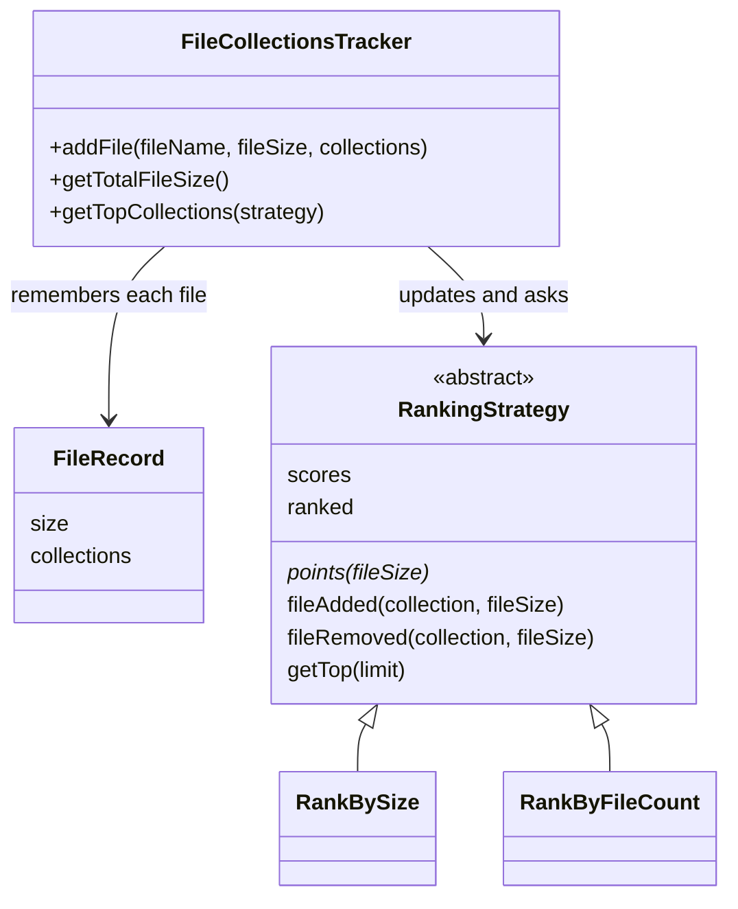

# Design a File Collections Tracker in Java

#### Problem Statement
[https://codezym.com/question/37-design-file-collections-tracker](https://codezym.com/question/37-design-file-collections-tracker)


We need to keep three kinds of numbers correct while files keep getting added and updated: the total size of all files, the total size of each collection, and the number of files in each collection. The core trick for updates is **undo, then redo**. When a file comes in again, we first take away everything its old version added, and then add the new version as if it were a brand new file.


For ranking, the **Strategy pattern** fits well. "Rank by size" and "rank by file count" are two strategies that differ in just one thing: how many points a file gives to each of its collections (its size, or 1). Each strategy keeps its own sorted set of collections, so the top 10 is always ready to read.


Strategy is the only pattern we need here. Combining it with other patterns would add code without making anything faster or clearer.


We will start with a brute force idea, see where it wastes time, and then improve it in two steps.


## The Key Idea: Undo, Then Redo

`addFile` can be called again for the same file with a new size and new collections. Instead of working out what exactly changed, we do two simple steps:

1. **Undo** the old version: subtract its old size from the total and from each old collection, and lower each old collection's file count by 1.
2. **Redo** with the new version: add the new size to the total and to each new collection, and raise each new collection's file count by 1.


To undo a file, we must remember its old size and old collections. That is why we store a small `FileRecord` for every file.


Here is the update from the problem's example, where `file1` changes from `(400 KB, [collection-1, travel-collection-2])` to `(50 KB, [work])`:

| Step | Total | collection-1 | travel-collection-2 | work |
|---|---|---|---|---|
| Before | 1000 | 500 KB, 2 files | 600 KB, 2 files | 200 KB, 1 file |
| Undo old file1 | 600 | 100 KB, 1 file | 200 KB, 1 file | 200 KB, 1 file |
| Redo new file1 | 650 | 100 KB, 1 file | 200 KB, 1 file | 250 KB, 2 files |


This gives exactly the expected answers. The total is 650. By size, the order is work, travel-collection-2, collection-1. By file count, work comes first, and collection-1 beats travel-collection-2 in the 1 file tie because its name is lexicographically smaller.


Two small rules complete the picture:

- A collection exists only while it has at least one file. When its last file leaves, we remove it, so it no longer shows up in the top list.
- If one `addFile` call repeats a collection name, the file still counts only once for that collection. Storing a file's collections in a `Set` takes care of this.


## Brute Force: Recount Everything on Every Query

The most direct approach stores only the files. On every `getTopCollections` call, it walks over all files, adds up the size and file count of each collection, sorts the collections and returns the first 10.


It is correct, but it repeats the same counting on every call, even when nothing has changed. With F files and up to C collections per file, each query costs O(F × C) just for counting, plus the sort.


## Solution 1: Running Totals, Sort When Asked

Let us stop recounting. We keep two maps that `addFile` updates using undo and redo:

- `collectionSize`: collection name → total size of its files
- `collectionCount`: collection name → number of files in it


`getTotalFileSize` returns a running total. `getTopCollections` picks the map that matches the strategy, sorts all collection names (higher score first, smaller name first on ties) and returns the first 10.

```java
import java.util.*;

/** What we remember about a file, so we can undo it when the file is updated. */
class FileRecord {
    int size;
    Set<String> collections;

    FileRecord(int size, Set<String> collections) {
        this.size = size;
        this.collections = collections;
    }
}

public class FileCollectionsTracker {
    // fileName -> latest size and collections of that file
    Map<String, FileRecord> files = new HashMap<>();
    // collection name -> total size of its files
    Map<String, Integer> collectionSize = new HashMap<>();
    // collection name -> number of files in it
    Map<String, Integer> collectionCount = new HashMap<>();
    int totalSize = 0;

    public FileCollectionsTracker() {
    }

    public void addFile(String fileName, int fileSize, List<String> collections) {
        FileRecord oldFile = files.get(fileName);
        if (oldFile != null) {
            removeFromStats(oldFile);   // undo the old version first
        }
        // a Set drops repeated names, so a file counts once per collection
        FileRecord newFile = new FileRecord(fileSize, new HashSet<>(collections));
        files.put(fileName, newFile);
        addToStats(newFile);
    }

    void addToStats(FileRecord file) {
        totalSize += file.size;
        for (String collection : file.collections) {
            collectionSize.put(collection, collectionSize.getOrDefault(collection, 0) + file.size);
            collectionCount.put(collection, collectionCount.getOrDefault(collection, 0) + 1);
        }
    }

    void removeFromStats(FileRecord file) {
        totalSize -= file.size;
        for (String collection : file.collections) {
            int count = collectionCount.get(collection) - 1;
            if (count == 0) {
                // the last file left this collection, so forget the collection
                collectionCount.remove(collection);
                collectionSize.remove(collection);
            } else {
                collectionCount.put(collection, count);
                collectionSize.put(collection, collectionSize.get(collection) - file.size);
            }
        }
    }

    public int getTotalFileSize() {
        return totalSize;
    }

    public List<String> getTopCollections(int strategy) {
        // strategy 0 ranks by total size, strategy 1 ranks by number of files
        Map<String, Integer> score = (strategy == 0) ? collectionSize : collectionCount;
        List<String> names = new ArrayList<>(score.keySet());
        // higher score first, smaller name first on ties
        names.sort((a, b) -> {
            int byScore = Integer.compare(score.get(b), score.get(a));
            return byScore != 0 ? byScore : a.compareTo(b);
        });
        return new ArrayList<>(names.subList(0, Math.min(10, names.size())));
    }
}
```


**Complexity:** with K collections, `addFile` is O(C), `getTotalFileSize` is O(1) and `getTopCollections` is O(K log K).


**What is still slow?** Every `getTopCollections` call sorts all K collections just to return 10 of them. If the top list is asked for often, we sort the same data again and again.


## Solution 2: Strategy Pattern + Sorted Sets (Optimized)

Instead of sorting when asked, we keep the collections **always sorted**. A sorted set (`TreeSet` in Java) does exactly this. Adding or removing an item costs O(log K), and items always come out in sorted order. So the top 10 is simply the first 10 items of the set.


We need one sorted order by size and another by file count. This is where the Strategy pattern helps.


### Why the Strategy Pattern?

Both rankings do the same work: keep a score for each collection, keep the collections sorted by score, and hand out the first 10. The only difference is how many points one file adds to each of its collections:

| Strategy | Points added by one file |
|---|---|
| 0: by total size | the file's size |
| 1: by file count | 1 |


So the shared work lives once in the abstract class `RankingStrategy`, and each concrete strategy (`RankBySize`, `RankByFileCount`) only answers one tiny question: `points(fileSize)`. We use an abstract class instead of an interface because both strategies share the same bookkeeping code.


The tracker keeps both strategies in a list where the position is the strategy number. So `getTopCollections(strategy)` is just `strategies.get(strategy).getTop(10)`.


**Why not plain if/else?** It works for two rankings, but then the tracker holds two maps and two sorted sets and checks the strategy number in several places. A new ranking rule would mean new fields in the tracker, plus edits in the update code and in `getTopCollections`. With Strategy, a new rule is one small class added to the list.


**Why not Observer?** It sounds like a fit, because every ranking must react when a file changes. But data changes in only one place (`addFile`), and the set of rankings never changes at runtime. A simple loop over the strategies does the job. Subscribe and unsubscribe code would add nothing.


**Why not a Factory?** Turning 0 or 1 into a new strategy object sounds natural. But a strategy has to see every file change from the start to keep its sorted set correct. A strategy created at query time would have to rebuild everything from all files, which is the brute force again. So both strategies are created once in the constructor, and the list index already maps the number to its strategy.


### Class Diagram




### Important Classes and Data Structures

- **`FileRecord`**: remembers the size and collections of each file. Without it, we could not undo a file's old version.
- **`Set<String>` of a file's collections**: drops repeated names, so a file counts once per collection.
- **`scores` map in each strategy**: collection name → current score. The sorted set reads it to compare two collections.
- **`ranked` sorted set in each strategy**: collection names in rank order (higher score first, then smaller name). Insert and remove cost O(log K), and the top 10 are the first 10 items.
- **`strategies` list in the tracker**: index 0 ranks by size, index 1 ranks by file count. Picking a strategy needs no if/else.


### Watch Out: Changing a Score Inside a Sorted Set

A sorted set decides where an item goes when the item is added. If we change a collection's score while it is still inside the set, the set does not move it. The order breaks, and the set may even fail to find that item later. So every score change in `changeScore` follows three steps:

1. Remove the collection from the sorted set, while its old score is still in the map.
2. Update its score in the map.
3. Add it back, so it lands in the right place for the new score.


If the new score is 0, the collection has no files left (every file adds at least 1 point). So we skip step 3 and remove it from the map too.


### Code

```java
import java.util.*;

/** What we remember about a file, so we can undo it when the file is updated. */
class FileRecord {
    int size;
    Set<String> collections;

    FileRecord(int size, Set<String> collections) {
        this.size = size;
        this.collections = collections;
    }
}

/**
 * Strategy: one way of ranking collections.
 * It keeps a score for every collection and keeps the collections
 * sorted by that score, so the top 10 is always ready to read.
 */
abstract class RankingStrategy {
    // collection name -> score (only collections that still have files)
    Map<String, Integer> scores = new HashMap<>();

    // collection names in rank order: higher score first, then smaller name first
    TreeSet<String> ranked = new TreeSet<>((a, b) -> {
        int byScore = Integer.compare(scores.get(b), scores.get(a));
        return byScore != 0 ? byScore : a.compareTo(b);
    });

    /** How much one file adds to the score of each of its collections. */
    abstract int points(int fileSize);

    void fileAdded(String collection, int fileSize) {
        changeScore(collection, points(fileSize));
    }

    void fileRemoved(String collection, int fileSize) {
        changeScore(collection, -points(fileSize));
    }

    /**
     * A sorted set does not move an item when its score changes.
     * So we take the item out, change its score, and put it back in.
     */
    void changeScore(String collection, int change) {
        int oldScore = scores.getOrDefault(collection, 0);
        if (oldScore > 0) {
            ranked.remove(collection);
        }
        int newScore = oldScore + change;
        if (newScore > 0) {
            scores.put(collection, newScore);
            ranked.add(collection);
        } else {
            // every file adds at least 1 point, so 0 means no files are left
            scores.remove(collection);
        }
    }

    /** Returns the first 'limit' collections in rank order. */
    List<String> getTop(int limit) {
        List<String> top = new ArrayList<>();
        for (String collection : ranked) {
            if (top.size() == limit) {
                break;
            }
            top.add(collection);
        }
        return top;
    }
}

/** Strategy 0: a file adds its size to each of its collections. */
class RankBySize extends RankingStrategy {
    @Override
    int points(int fileSize) {
        return fileSize;
    }
}

/** Strategy 1: a file adds 1 to each of its collections. */
class RankByFileCount extends RankingStrategy {
    @Override
    int points(int fileSize) {
        return 1;
    }
}

public class FileCollectionsTracker {
    // fileName -> latest size and collections of that file
    Map<String, FileRecord> files = new HashMap<>();
    int totalSize = 0;
    // position in this list = strategy number (0 = by size, 1 = by file count)
    List<RankingStrategy> strategies = new ArrayList<>();

    public FileCollectionsTracker() {
        strategies.add(new RankBySize());
        strategies.add(new RankByFileCount());
    }

    public void addFile(String fileName, int fileSize, List<String> collections) {
        FileRecord oldFile = files.get(fileName);
        if (oldFile != null) {
            removeFromStats(oldFile);   // undo the old version first
        }
        // a Set drops repeated names, so a file counts once per collection
        FileRecord newFile = new FileRecord(fileSize, new HashSet<>(collections));
        files.put(fileName, newFile);
        addToStats(newFile);
    }

    /** Tells every strategy that this file joined each of its collections. */
    void addToStats(FileRecord file) {
        totalSize += file.size;
        for (String collection : file.collections) {
            for (RankingStrategy strategy : strategies) {
                strategy.fileAdded(collection, file.size);
            }
        }
    }

    /** Tells every strategy that this file left each of its collections. */
    void removeFromStats(FileRecord file) {
        totalSize -= file.size;
        for (String collection : file.collections) {
            for (RankingStrategy strategy : strategies) {
                strategy.fileRemoved(collection, file.size);
            }
        }
    }

    public int getTotalFileSize() {
        return totalSize;
    }

    public List<String> getTopCollections(int strategy) {
        return strategies.get(strategy).getTop(10);
    }
}
```


### Complexity

| Method | Solution 1 | Solution 2 |
|---|---|---|
| `addFile` | O(C) | O(C log K) |
| `getTotalFileSize` | O(1) | O(1) |
| `getTopCollections` | O(K log K) | O(log K), it reads only the first 10 items |


Here K is the number of collections and C is the number of collections in the old plus the new version of the file. Solution 2 pays a small O(log K) cost for each collection a file touches, so that every top 10 query is almost instant. That is the right trade when the top list is read often.