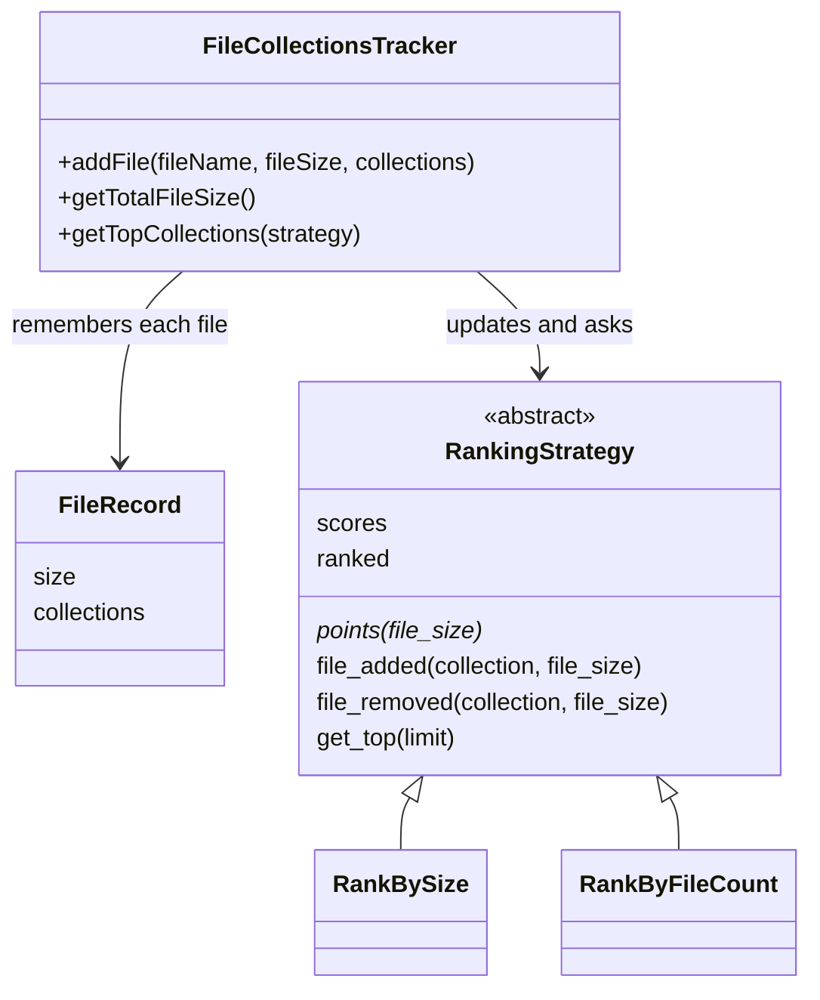

# Design a File Collections Tracker in Python

#### Problem Statement
[https://codezym.com/question/37-design-file-collections-tracker](https://codezym.com/question/37-design-file-collections-tracker)


We need to keep three kinds of numbers correct while files keep getting added and updated: the total size of all files, the total size of each collection, and the number of files in each collection. The core trick for updates is **undo, then redo**. When a file comes in again, we first take away everything its old version added, and then add the new version as if it were a brand new file.


For ranking, the **Strategy pattern** fits well. "Rank by size" and "rank by file count" are two strategies that differ in just one thing: how many points a file gives to each of its collections (its size, or 1). Each strategy keeps its own sorted list of collections, so the top 10 is always ready to read.


Strategy is the only pattern we need here. Combining it with other patterns would add code without making anything faster or clearer.


We will start with a brute force idea, see where it wastes time, and then improve it in two steps.


## The Key Idea: Undo, Then Redo

`addFile` can be called again for the same file with a new size and new collections. Instead of working out what exactly changed, we do two simple steps:

1. **Undo** the old version: subtract its old size from the total and from each old collection, and lower each old collection's file count by 1.
2. **Redo** with the new version: add the new size to the total and to each new collection, and raise each new collection's file count by 1.


To undo a file, we must remember its old size and old collections. That is why we store a small `FileRecord` for every file.


Here is the update from the problem's example, where `file1` changes from `(400 KB, [collection-1, travel-collection-2])` to `(50 KB, [work])`:

| Step | Total | collection-1 | travel-collection-2 | work |
|---|---|---|---|---|
| Before | 1000 | 500 KB, 2 files | 600 KB, 2 files | 200 KB, 1 file |
| Undo old file1 | 600 | 100 KB, 1 file | 200 KB, 1 file | 200 KB, 1 file |
| Redo new file1 | 650 | 100 KB, 1 file | 200 KB, 1 file | 250 KB, 2 files |


This gives exactly the expected answers. The total is 650. By size, the order is work, travel-collection-2, collection-1. By file count, work comes first, and collection-1 beats travel-collection-2 in the 1 file tie because its name is lexicographically smaller.


Two small rules complete the picture:

- A collection exists only while it has at least one file. When its last file leaves, we remove it, so it no longer shows up in the top list.
- If one `addFile` call repeats a collection name, the file still counts only once for that collection. Storing a file's collections in a `set` takes care of this.


## Brute Force: Recount Everything on Every Query

The most direct approach stores only the files. On every `getTopCollections` call, it walks over all files, adds up the size and file count of each collection, sorts the collections and returns the first 10.


It is correct, but it repeats the same counting on every call, even when nothing has changed. With F files and up to C collections per file, each query costs O(F × C) just for counting, plus the sort.


## Solution 1: Running Totals, Sort When Asked

Let us stop recounting. We keep two dicts that `addFile` updates using undo and redo:

- `collection_size`: collection name → total size of its files
- `collection_count`: collection name → number of files in it


`getTotalFileSize` returns a running total. `getTopCollections` picks the dict that matches the strategy, sorts all collection names (higher score first, smaller name first on ties) and returns the first 10.


The sort key `(-score[name], name)` does both jobs at once. Python compares tuples item by item, so the minus sign puts bigger scores first, and equal scores fall back to comparing names.

```python
class FileRecord:
    """What we remember about a file, so we can undo it when the file is updated."""

    def __init__(self, size, collections):
        self.size = size
        self.collections = collections  # set of collection names


class FileCollectionsTracker:
    def __init__(self):
        self.files = {}             # fileName -> latest FileRecord of that file
        self.collection_size = {}   # collection name -> total size of its files
        self.collection_count = {}  # collection name -> number of files in it
        self.total_size = 0

    def addFile(self, fileName, fileSize, collections):
        old_file = self.files.get(fileName)
        if old_file is not None:
            self.remove_from_stats(old_file)  # undo the old version first
        # a set drops repeated names, so a file counts once per collection
        new_file = FileRecord(fileSize, set(collections))
        self.files[fileName] = new_file
        self.add_to_stats(new_file)

    def add_to_stats(self, file):
        self.total_size += file.size
        for collection in file.collections:
            size = self.collection_size.get(collection, 0)
            count = self.collection_count.get(collection, 0)
            self.collection_size[collection] = size + file.size
            self.collection_count[collection] = count + 1

    def remove_from_stats(self, file):
        self.total_size -= file.size
        for collection in file.collections:
            count = self.collection_count[collection] - 1
            if count == 0:
                # the last file left this collection, so forget the collection
                del self.collection_count[collection]
                del self.collection_size[collection]
            else:
                self.collection_count[collection] = count
                self.collection_size[collection] -= file.size

    def getTotalFileSize(self):
        return self.total_size

    def getTopCollections(self, strategy):
        # strategy 0 ranks by total size, strategy 1 ranks by number of files
        score = self.collection_size if strategy == 0 else self.collection_count
        # higher score first, smaller name first on ties
        names = sorted(score, key=lambda name: (-score[name], name))
        return names[:10]
```


**Complexity:** with K collections, `addFile` is O(C), `getTotalFileSize` is O(1) and `getTopCollections` is O(K log K).


**What is still slow?** Every `getTopCollections` call sorts all K collections just to return 10 of them. If the top list is asked for often, we sort the same data again and again.


## Solution 2: Strategy Pattern + Sorted Lists (Optimized)

Instead of sorting when asked, we keep the collections **always sorted**. Python has no built-in sorted set, but a normal list kept in order with the `bisect` module does the job. Binary search finds the right spot for each entry, and the top 10 is simply the first 10 entries of the list.


We need one sorted order by size and another by file count. This is where the Strategy pattern helps.


### Why the Strategy Pattern?

Both rankings do the same work: keep a score for each collection, keep the collections sorted by score, and hand out the first 10. The only difference is how many points one file adds to each of its collections:

| Strategy | Points added by one file |
|---|---|
| 0: by total size | the file's size |
| 1: by file count | 1 |


So the shared work lives once in the base class `RankingStrategy`, and each concrete strategy (`RankBySize`, `RankByFileCount`) only answers one tiny question: `points(file_size)`.


The tracker keeps both strategies in a list where the position is the strategy number. So `getTopCollections(strategy)` is just `self.strategies[strategy].get_top(10)`.


**Why not plain if/else?** It works for two rankings, but then the tracker holds two dicts and two sorted lists and checks the strategy number in several places. A new ranking rule would mean new fields in the tracker, plus edits in the update code and in `getTopCollections`. With Strategy, a new rule is one small class added to the list.


**Why not Observer?** It sounds like a fit, because every ranking must react when a file changes. But data changes in only one place (`addFile`), and the set of rankings never changes at runtime. A simple loop over the strategies does the job. Subscribe and unsubscribe code would add nothing.


**Why not a Factory?** Turning 0 or 1 into a new strategy object sounds natural. But a strategy has to see every file change from the start to keep its sorted list correct. A strategy created at query time would have to rebuild everything from all files, which is the brute force again. So both strategies are created once in the constructor, and the list index already maps the number to its strategy.


### Class Diagram




### Important Classes and Data Structures

- **`FileRecord`**: remembers the size and collections of each file. Without it, we could not undo a file's old version.
- **`set` of a file's collections**: drops repeated names, so a file counts once per collection.
- **`scores` dict in each strategy**: collection name → current score. We need the old score to find the collection's old entry in the sorted list.
- **`ranked` sorted list in each strategy**: entries of `(-score, name)`, kept in order with `bisect`. Bigger scores come first, and ties go to the smaller name. The top 10 are the first 10 entries.
- **`strategies` list in the tracker**: index 0 ranks by size, index 1 ranks by file count. Picking a strategy needs no if/else.


### Watch Out: Changing a Score Inside the Sorted List

Each entry in the sorted list holds the score itself. When a collection's score changes, its old entry is no longer correct, and replacing it at the same position would break the order. So every score change in `change_score` follows three steps:

1. Find the old entry `(-old_score, name)` with `bisect_left` and remove it.
2. Update the score in the `scores` dict.
3. Insert the new entry `(-new_score, name)` with `insort`, which puts it in the right place.


If the new score is 0, the collection has no files left (every file adds at least 1 point). So we skip step 3 and remove it from the dict too.


### Code

```python
from bisect import bisect_left, insort


class FileRecord:
    """What we remember about a file, so we can undo it when the file is updated."""

    def __init__(self, size, collections):
        self.size = size
        self.collections = collections  # set of collection names


class RankingStrategy:
    """
    Strategy: one way of ranking collections.
    It keeps a score for every collection and keeps the collections
    sorted by that score, so the top 10 is always ready to read.
    """

    def __init__(self):
        # collection name -> score (only collections that still have files)
        self.scores = {}
        # sorted list of (-score, name): higher score first, then smaller name first
        self.ranked = []

    def points(self, file_size):
        """How much one file adds to the score of each of its collections."""
        raise NotImplementedError

    def file_added(self, collection, file_size):
        self.change_score(collection, self.points(file_size))

    def file_removed(self, collection, file_size):
        self.change_score(collection, -self.points(file_size))

    def change_score(self, collection, change):
        """
        Each entry in the sorted list holds the score itself.
        So we take the old entry out and put a new one in its right place.
        """
        old_score = self.scores.get(collection, 0)
        if old_score > 0:
            index = bisect_left(self.ranked, (-old_score, collection))
            self.ranked.pop(index)
        new_score = old_score + change
        if new_score > 0:
            self.scores[collection] = new_score
            insort(self.ranked, (-new_score, collection))
        else:
            # every file adds at least 1 point, so 0 means no files are left
            self.scores.pop(collection, None)

    def get_top(self, limit):
        """Returns the first 'limit' collections in rank order."""
        return [name for _, name in self.ranked[:limit]]


class RankBySize(RankingStrategy):
    """Strategy 0: a file adds its size to each of its collections."""

    def points(self, file_size):
        return file_size


class RankByFileCount(RankingStrategy):
    """Strategy 1: a file adds 1 to each of its collections."""

    def points(self, file_size):
        return 1


class FileCollectionsTracker:
    def __init__(self):
        self.files = {}  # fileName -> latest FileRecord of that file
        self.total_size = 0
        # position in this list = strategy number (0 = by size, 1 = by file count)
        self.strategies = [RankBySize(), RankByFileCount()]

    def addFile(self, fileName, fileSize, collections):
        old_file = self.files.get(fileName)
        if old_file is not None:
            self.remove_from_stats(old_file)  # undo the old version first
        # a set drops repeated names, so a file counts once per collection
        new_file = FileRecord(fileSize, set(collections))
        self.files[fileName] = new_file
        self.add_to_stats(new_file)

    def add_to_stats(self, file):
        """Tells every strategy that this file joined each of its collections."""
        self.total_size += file.size
        for collection in file.collections:
            for strategy in self.strategies:
                strategy.file_added(collection, file.size)

    def remove_from_stats(self, file):
        """Tells every strategy that this file left each of its collections."""
        self.total_size -= file.size
        for collection in file.collections:
            for strategy in self.strategies:
                strategy.file_removed(collection, file.size)

    def getTotalFileSize(self):
        return self.total_size

    def getTopCollections(self, strategy):
        return self.strategies[strategy].get_top(10)
```


### Complexity

| Method | Solution 1 | Solution 2 |
|---|---|---|
| `addFile` | O(C) | O(C × K) in theory, fast in practice |
| `getTotalFileSize` | O(1) | O(1) |
| `getTopCollections` | O(K log K) | O(1), it copies only the first 10 entries |


Here K is the number of collections and C is the number of collections in the old plus the new version of the file.


In Solution 2, `bisect` finds the right spot in O(log K). Inserting into or removing from the middle of a Python list then shifts the entries after it, which is O(K) in theory. But that shift is a single fast memory copy, so it stays quick even with tens of thousands of collections.


In return, `getTopCollections` does no sorting at all. That is the right trade when the top list is read often.