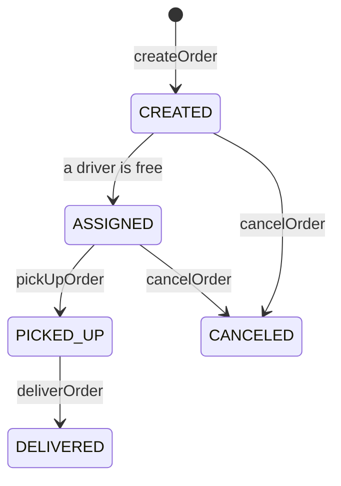

# Design Peer to Peer Parcel Delivery System in Python

#### Problem Statement
[https://codezym.com/question/76-design-peer-to-peer-parcel-delivery](https://codezym.com/question/76-design-peer-to-peer-parcel-delivery)

---

## Core Idea

Every order follows a fixed path: it is created, gets a driver, gets picked up and is finally delivered. It can also be canceled, but only before pickup.

So an order is just a small **state machine**. An enum plus one rule method handles it cleanly. Patterns like State or Strategy would only add extra classes here, so this solution does not need any design pattern.

The real work is matching orders with drivers. Free drivers sit in a **min-heap**, so the lexicographically smallest driver id is always on top.

Waiting orders sit in a **queue**, so the oldest order is always served first. Whenever a driver becomes free, it takes the next waiting order.

---

## Order Life Cycle


```mermaid
stateDiagram-v2
    [*] --> CREATED : createOrder
    CREATED --> ASSIGNED : a driver is free
    ASSIGNED --> PICKED_UP : pickUpOrder
    PICKED_UP --> DELIVERED : deliverOrder
    CREATED --> CANCELED : cancelOrder
    ASSIGNED --> CANCELED : cancelOrder
```

- `CREATED`: the order is waiting for a driver.
- `ASSIGNED`: a driver is reserved for the order but has not picked it up yet.
- `PICKED_UP`: the driver has the parcel. Canceling is not allowed anymore.
- `DELIVERED` and `CANCELED` are final states.

A driver is either `AVAILABLE` or `BUSY:<orderId>`. It stays busy from assignment until delivery, or until its assigned order is canceled.

---

## Approach 1: Brute Force (Scan Everything)

Whenever a new order arrives or a driver becomes free, we need two answers:

1. Which free driver has the smallest id?
2. Which waiting order is the oldest?

The simplest way is to scan everything. Here `self.allOrders` is a list of all orders, in creation order.

```python
# scan every driver and keep the smallest free id
def findFreeDriver(self):
    best = None
    for driver in self.drivers.values():
        if driver.isAvailable() and (best is None or driver.driverId < best):
            best = driver.driverId
    return best


# scan all orders in creation order and return the first one still waiting
def findOldestWaitingOrder(self):
    for order in self.allOrders:
        if order.status == OrderStatus.CREATED:
            return order
    return None
```

Notice that we compare driver ids as **strings**. In lexicographic order `dv-10` comes before `dv-2`. A loop that goes `dv-0, dv-1, dv-2 ...` by number would pick the wrong driver.

**Problems with this approach**

- `findFreeDriver()` checks all `D` drivers every single time.
- `findOldestWaitingOrder()` checks all `N` orders ever created, even delivered and canceled ones.

Both become slow as the system grows. Let's fix them one at a time.

---

## Approach 2: Min-Heap + Queue (Optimal)

### Fix 1: Min-heap for free drivers

A min-heap always keeps the smallest element on top. The `heapq` module turns a plain list into a min-heap, with the smallest item at index `0`. Strings are compared lexicographically by default, which is exactly our rule.

- Take the smallest free driver with `heapq.heappop()` in `O(log D)`.
- Put a driver back with `heapq.heappush()` in `O(log D)` when it becomes free.

We never need to remove a driver from the middle of the heap. A driver leaves the heap only when it gets an order, and orders always go to the driver on top.

### Fix 2: Queue for waiting orders

An order that can't get a driver right away goes to the back of a queue (`collections.deque`). Orders leave from the front with `popleft()` in `O(1)`, so the oldest one is always served first.

What if a waiting order is canceled? Searching the queue to remove it would be slow. So we only mark it `CANCELED` and leave it there.

When it reaches the front later, we see it is canceled and simply drop it. This trick is called **lazy removal**.

### When does matching happen?

Only at two moments:

1. **A new order arrives.** If a driver is free, assign it now and return `ACCEPTED`. Otherwise add the order to the queue and return `PENDING`.
2. **A driver becomes free.** This happens after a delivery, or when an `ASSIGNED` order is canceled. The driver goes back into the heap and takes the next waiting order.

Because we match at both moments, a free driver and a waiting order never exist together. So when a new order finds a free driver, the queue is already empty and oldest first is still respected.

### Other rules worth noticing

- `createOrder` returns `INVALID` for a duplicate order id, an unknown customer or an unknown item.
- `pickUpOrder` and `deliverOrder` only work for the order's own driver. A wrong or unknown driver id never matches, so one check covers both cases.
- The two status methods return `ERROR` for an unknown id.

---

## Do We Need Design Patterns?

**State pattern** looks like a natural fit because an order has states. But it needs one class per state. With 5 states and 3 actions (cancel, pick up, deliver) that is 15 small methods, and 11 of them just return `ERROR`.

Freeing a driver also needs the heap and the queue, which live in the main class. So the state classes would need a link back to the main system. One `canMoveTo()` method that lists the valid moves is much simpler.

**Strategy pattern** could make the driver choosing rule pluggable, like nearest driver or best rated driver. But this problem has exactly one fixed rule: the smallest driver id. An interface with a single implementation only adds code.

So we keep it simple: a few small classes, an enum for order states and the right data structures.

---

## Classes and Data Structures

| Class | Why we need it |
|---|---|
| `OrderStatus` | Enum of the 5 order states. Safer than typing raw strings. |
| `Order` | Holds order details, status and the assigned driver. `canMoveTo()` keeps every state rule in one place. |
| `Driver` | Remembers the one order the driver is carrying and builds the `AVAILABLE` or `BUSY:<orderId>` text. |
| `PeerToPeerDeliverySystem` | Main class. Validates requests and matches orders with drivers. |

| Data structure | Why we need it |
|---|---|
| `customerIds`, `deliverableItemIds` (sets) | Validate a customer or item in `O(1)` without parsing ids. |
| `drivers`, `orders` (dicts) | Find any driver or order by id in `O(1)`. |
| `availableDrivers` (list used as a heap) | Gives the smallest free driver id in `O(log D)`. |
| `pendingOrders` (deque) | Keeps waiting orders, oldest first. |

---

## Final Code

```python
import heapq
from collections import deque
from enum import Enum
from typing import List


class OrderStatus(Enum):
    """All the states an order can be in."""
    CREATED = "CREATED"
    ASSIGNED = "ASSIGNED"
    PICKED_UP = "PICKED_UP"
    DELIVERED = "DELIVERED"
    CANCELED = "CANCELED"


class Order:
    """One parcel delivery request placed by a customer."""

    def __init__(self, orderId: str, customerId: str, itemId: str):
        self.orderId = orderId
        self.customerId = customerId
        self.itemId = itemId
        self.status = OrderStatus.CREATED
        self.driverId = None  # None until a driver is assigned

    def canMoveTo(self, nextStatus: OrderStatus) -> bool:
        """
        The order state machine. Valid moves are:
        CREATED -> ASSIGNED -> PICKED_UP -> DELIVERED
        CREATED or ASSIGNED -> CANCELED
        """
        if self.status == OrderStatus.CREATED:
            return nextStatus in (OrderStatus.ASSIGNED, OrderStatus.CANCELED)
        if self.status == OrderStatus.ASSIGNED:
            return nextStatus in (OrderStatus.PICKED_UP, OrderStatus.CANCELED)
        if self.status == OrderStatus.PICKED_UP:
            return nextStatus == OrderStatus.DELIVERED
        return False  # no moves out of DELIVERED or CANCELED


class Driver:
    """A driver carries at most one order at a time."""

    def __init__(self, driverId: str):
        self.driverId = driverId
        self.currentOrderId = None  # None means the driver is free

    def isAvailable(self) -> bool:
        return self.currentOrderId is None

    def getStatus(self) -> str:
        if self.isAvailable():
            return "AVAILABLE"
        return "BUSY:" + self.currentOrderId


class PeerToPeerDeliverySystem:
    def __init__(self, totalUsers: int, totalDrivers: int,
                 deliverableItemIds: List[str]):
        self.customerIds = {"user-" + str(i) for i in range(totalUsers)}
        self.deliverableItemIds = set(deliverableItemIds)
        self.drivers = {}  # driverId -> Driver
        self.orders = {}  # orderId -> Order

        # min-heap of free drivers,
        # the lexicographically smallest id is always at index 0
        self.availableDrivers = []

        # orders waiting for a driver, oldest first
        # a canceled order may still sit here,
        # it is dropped when it reaches the front
        self.pendingOrders = deque()

        for i in range(totalDrivers):
            driverId = "dv-" + str(i)
            self.drivers[driverId] = Driver(driverId)
            heapq.heappush(self.availableDrivers, driverId)

    def createOrder(self, orderId: str, customerId: str, itemId: str) -> str:
        if (orderId in self.orders or customerId not in self.customerIds
                or itemId not in self.deliverableItemIds):
            return "INVALID"
        order = Order(orderId, customerId, itemId)
        self.orders[orderId] = order

        if not self.availableDrivers:
            self.pendingOrders.append(order)
            return "PENDING"
        self.assignOrder(order, heapq.heappop(self.availableDrivers))
        return "ACCEPTED"

    def cancelOrder(self, orderId: str) -> str:
        order = self.orders.get(orderId)
        if order is None or not order.canMoveTo(OrderStatus.CANCELED):
            return "ERROR"
        order.status = OrderStatus.CANCELED

        # ASSIGNED order: its driver was waiting, so set the driver free.
        # CREATED order: it stays in pendingOrders and is dropped later.
        if order.driverId is not None:
            self.freeDriver(order.driverId)
        return "CANCELED"

    def pickUpOrder(self, driverId: str, orderId: str) -> str:
        order = self.orders.get(orderId)
        # a wrong or unknown driverId never matches order.driverId
        if (order is None or not order.canMoveTo(OrderStatus.PICKED_UP)
                or order.driverId != driverId):
            return "ERROR"
        order.status = OrderStatus.PICKED_UP
        return "PICKED_UP"

    def deliverOrder(self, driverId: str, orderId: str) -> str:
        order = self.orders.get(orderId)
        if (order is None or not order.canMoveTo(OrderStatus.DELIVERED)
                or order.driverId != driverId):
            return "ERROR"
        order.status = OrderStatus.DELIVERED
        self.freeDriver(driverId)
        return "DELIVERED"

    def getOrderStatus(self, orderId: str) -> str:
        order = self.orders.get(orderId)
        return "ERROR" if order is None else order.status.value

    def getDriverStatus(self, driverId: str) -> str:
        driver = self.drivers.get(driverId)
        return "ERROR" if driver is None else driver.getStatus()

    def assignOrder(self, order: Order, driverId: str) -> None:
        """Links an order with a driver."""
        order.status = OrderStatus.ASSIGNED
        order.driverId = driverId
        self.drivers[driverId].currentOrderId = order.orderId

    def freeDriver(self, driverId: str) -> None:
        """Marks a driver as free and hands out waiting orders."""
        self.drivers[driverId].currentOrderId = None
        heapq.heappush(self.availableDrivers, driverId)
        self.assignPendingOrders()

    def assignPendingOrders(self) -> None:
        """Gives waiting orders to free drivers, oldest order first."""
        while self.availableDrivers and self.pendingOrders:
            order = self.pendingOrders.popleft()
            # lazy removal: a canceled order is simply dropped
            if order.status == OrderStatus.CREATED:
                self.assignOrder(order, heapq.heappop(self.availableDrivers))
```

---

## Complexity

| Method | Time |
|---|---|
| `createOrder` | `O(log D)` |
| `cancelOrder` | `O(log D)` |
| `pickUpOrder` | `O(1)` |
| `deliverOrder` | `O(log D)` |
| `getOrderStatus`, `getDriverStatus` | `O(1)` |

`D` is the number of drivers. Dropping canceled orders from the queue adds a little extra work, but each order is dropped at most once in total. So on average `cancelOrder` and `deliverOrder` stay `O(log D)`.

Space is `O(U + D + I + N)` for users, drivers, items and orders.