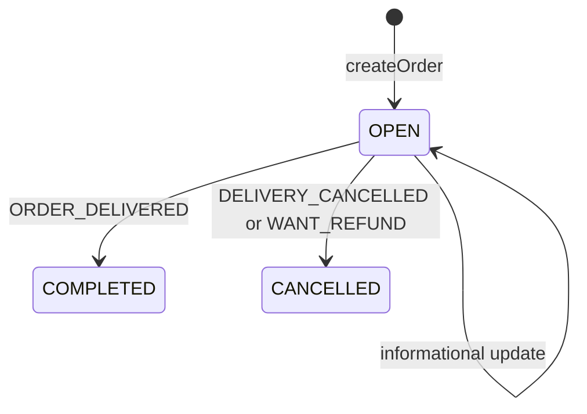

# Design Workflow Automation Engine in Java

#### Problem Statement
[https://codezym.com/question/98-design-workflow-automation-engine](https://codezym.com/question/98-design-workflow-automation-engine)

Every order in this problem is a small state machine. It starts `OPEN` and ends as `COMPLETED` or `CANCELLED`, and the result of a status update depends mostly on two things: the order's **current state** and the **status code**. That is exactly what the **State pattern** is for, so each state becomes a small class with its own rules. Refund percentages are business rules that change often, so we keep them in one place with the **Strategy pattern**. Using **State + Strategy together** is the cleanest design here: State handles the order lifecycle, Strategy handles the money.

We first build a simple if-else version so every rule is visible in one place. Then we look at its problems and improve it.

## Rules at a Glance

Every call to `updateOrderStatus()` starts with the same three lines: `ORDER:<orderId>`, `BY:<by>` and `STATUS:<statusCode>`. The lines after them depend on the current state and the status code.

In the table, "refund lines" means `ACTION:ISSUE_REFUND` followed by `REFUND_PERCENT:<percent>`.

| Current state | Status update | Result lines | New state |
|---|---|---|---|
| OPEN | any informational status | `ACTION:CONTINUE_ORDER` | OPEN |
| OPEN | `ORDER_DELIVERED` | `LATE:true/false`, `ACTION:COMPLETE_ORDER`, refund lines if 10+ minutes late | COMPLETED |
| OPEN | `DELIVERY_CANCELLED` | `ACTION:CANCEL_ORDER`, refund lines with 100 | CANCELLED |
| OPEN | `WANT_REFUND` | refund lines with 95 (preparation not started) or 100 (started), then `ACTION:CANCEL_ORDER` | CANCELLED |
| COMPLETED | `WANT_REFUND` | `ACTION:REFUND_ALREADY_ISSUED`, or refund lines based on stored lateness, or `ACTION:NO_REFUND_RULE_MATCH` | COMPLETED |
| COMPLETED | anything else | `ACTION:IGNORED_ORDER_ALREADY_CLOSED` | no change |
| CANCELLED | anything, even `WANT_REFUND` | `ACTION:IGNORED_ORDER_ALREADY_CLOSED` | no change |

The six informational statuses are `ORDER_GETTING_PREPARED`, `OUT_FOR_DELIVERY`, `RAIN_DELAY`, `DASHER_REACHED_DELIVERY_LOCATION`, `CUSTOMER_UNREACHABLE` and `DASHER_UNREACHABLE`. Only `ORDER_GETTING_PREPARED` changes something: it marks that preparation has started.

**Late delivery refund:** less than 10 minutes late gives no refund, 10 to 20 minutes gives 50%, more than 20 minutes gives 100%.

### Log Traps to Watch

The logic is simple, but the log lines are easy to get wrong.

1. `LATE:...` must come right after `STATUS:...`, so add it **before** `ACTION:COMPLETE_ORDER`.
2. `REFUND_PERCENT:...` must come right after `ACTION:ISSUE_REFUND`. We always write both lines from one helper, so they can never get separated.
3. Cancel and refund lines switch places. `DELIVERY_CANCELLED` logs `ACTION:CANCEL_ORDER` first, then the refund. `WANT_REFUND` on an open order logs the refund first, then `ACTION:CANCEL_ORDER`.
4. A repeated `WANT_REFUND` gets two different answers. A `COMPLETED` order replies `ACTION:REFUND_ALREADY_ISSUED`. A `CANCELLED` order replies `ACTION:IGNORED_ORDER_ALREADY_CLOSED`, because the refund decided at cancellation time is final.

## Solution 1: Simple If-Else Version

### Idea

Store one `Order` object per order and write all the rules inside `updateOrderStatus()` as plain if-else blocks.

- **`HashMap<String, Order> orders`:** every update comes with an `orderId`, so we need a fast O(1) lookup from id to order.
- **`Order`:** besides the ids and `deliveryETA`, it remembers the current `state` and three facts that later updates need:
  - `preparationStarted`: decides 95% vs 100% when the customer cancels.
  - `refundIssued`: makes sure an order never gets a second refund.
  - `minutesLate`: saved at delivery, so a later `WANT_REFUND` can reuse it.
- **`HashSet<String>` for users and restaurants:** the problem asks the system to keep them in memory. Inputs are always valid, so we never have to check them.

`updateOrderStatus()` writes the three header lines, then checks the state. An `OPEN` order reacts to the status code. A `COMPLETED` order only reacts to `WANT_REFUND`. Everything else is ignored, including every update on a `CANCELLED` order.

Two small helpers keep it tidy. `lateDeliveryPercent()` turns minutes late into a refund percent, and `issueRefund()` sets the flag and writes both refund lines together.

### Code

```java
import java.util.*;

/**
 * Everything we need to remember about one order.
 */
class Order {
    String orderId;
    String restaurantId;
    String userId;
    int deliveryETA;

    String state = "OPEN";              // OPEN, COMPLETED or CANCELLED
    boolean preparationStarted = false; // decides 95% vs 100% on WANT_REFUND
    boolean refundIssued = false;       // at most one refund per order
    int minutesLate = 0;                // saved on delivery, reused by a later WANT_REFUND

    Order(String orderId, String restaurantId, String userId, int deliveryETA) {
        this.orderId = orderId;
        this.restaurantId = restaurantId;
        this.userId = userId;
        this.deliveryETA = deliveryETA;
    }
}

public class WorkflowAutomator {
    Set<String> users = new HashSet<>();
    Set<String> restaurants = new HashSet<>();
    Map<String, Order> orders = new HashMap<>(); // orderId -> Order

    public WorkflowAutomator(List<String> existingUsers, List<String> existingRestaurants) {
        users.addAll(existingUsers);
        restaurants.addAll(existingRestaurants);
    }

    public void createOrder(String orderId, String restaurantId, String userId, int deliveryETA, int currentTime) {
        orders.put(orderId, new Order(orderId, restaurantId, userId, deliveryETA));
    }

    public List<String> updateOrderStatus(String orderId, String by, int currentTime, String statusCode) {
        Order order = orders.get(orderId);
        List<String> logs = new ArrayList<>();
        logs.add("ORDER:" + orderId);
        logs.add("BY:" + by);
        logs.add("STATUS:" + statusCode);

        if (order.state.equals("OPEN")) {
            if (statusCode.equals("ORDER_DELIVERED")) {
                order.minutesLate = currentTime - order.deliveryETA;
                logs.add("LATE:" + (order.minutesLate > 0)); // must come right after STATUS
                order.state = "COMPLETED";
                logs.add("ACTION:COMPLETE_ORDER");
                int percent = lateDeliveryPercent(order.minutesLate);
                if (percent > 0) {
                    issueRefund(order, percent, logs);
                }
            } else if (statusCode.equals("DELIVERY_CANCELLED")) {
                order.state = "CANCELLED";
                logs.add("ACTION:CANCEL_ORDER");
                issueRefund(order, 100, logs);
            } else if (statusCode.equals("WANT_REFUND")) {
                // customer cancels: refund first, then cancel
                issueRefund(order, order.preparationStarted ? 100 : 95, logs);
                order.state = "CANCELLED";
                logs.add("ACTION:CANCEL_ORDER");
            } else {
                // informational update, the order stays OPEN
                if (statusCode.equals("ORDER_GETTING_PREPARED")) {
                    order.preparationStarted = true;
                }
                logs.add("ACTION:CONTINUE_ORDER");
            }
        } else if (order.state.equals("COMPLETED") && statusCode.equals("WANT_REFUND")) {
            // the only update a closed order still reacts to
            if (order.refundIssued) {
                logs.add("ACTION:REFUND_ALREADY_ISSUED");
            } else {
                // no refund yet: decide using the stored lateness
                int percent = lateDeliveryPercent(order.minutesLate);
                if (percent > 0) {
                    issueRefund(order, percent, logs);
                } else {
                    logs.add("ACTION:NO_REFUND_RULE_MATCH");
                }
            }
        } else {
            // CANCELLED ignores every update (its refund is final),
            // COMPLETED ignores every non-refund update
            logs.add("ACTION:IGNORED_ORDER_ALREADY_CLOSED");
        }
        return logs;
    }

    /** Less than 10 minutes late: 0, 10 to 20 minutes: 50, more than 20 minutes: 100. */
    int lateDeliveryPercent(int minutesLate) {
        if (minutesLate < 10) return 0;
        if (minutesLate <= 20) return 50;
        return 100;
    }

    /** Marks the refund as issued and writes both refund lines together. */
    void issueRefund(Order order, int percent, List<String> logs) {
        order.refundIssued = true;
        logs.add("ACTION:ISSUE_REFUND");
        logs.add("REFUND_PERCENT:" + percent);
    }
}
```

### What Is Wrong With This Version?

It gives the right answers, but it does not grow well.

1. **All rules sit in one big method.** Adding a new state (say `ON_HOLD`) or a new status means editing the same nested if-else and re-checking every branch. Fixing one rule can easily break another.
2. **Business numbers are mixed with flow logic.** The values 10, 20, 50, 95 and 100 are buried inside the state changes. Changing a refund rule means touching the code that moves orders between states.

The next solution fixes both problems.

## Solution 2: State Pattern + Strategy Pattern

### Why the State Pattern?

Look at the rules table again. Every row is "state + status gives behavior". The State pattern turns each state into its own class:

- `OpenState` knows how an open order reacts.
- `CompletedState` and `CancelledState` know how closed orders react.

`updateOrderStatus()` no longer checks the state at all. It just calls the current state object, and that object decides what happens and which state comes next. A new state is a new class, and the existing ones stay untouched.



Once an order leaves `OPEN`, its state never changes again. Only a `COMPLETED` order still reacts to `WANT_REFUND`. A `CANCELLED` order ignores everything.

### Why the Strategy Pattern for Refunds?

Part 2 of the problem is all about compensation amounts, and those are the rules most likely to change. Putting them behind a `RefundPolicy` interface means:

- State classes only ask "how much?". They never know the numbers.
- A new set of rules (for example, a holiday policy that pays 100% for any late order) is just a new class plugged in at one place.

### Patterns That Sound Good but Are Not the Best Fit

- **Chain of Responsibility:** a list of rule handlers where each one checks "is this update mine?". It sounds natural for an automation engine. But here the current state and the status code already tell us exactly which rule to run, so calling the state directly is simpler. A chain also makes handler order matter (the "order already closed" check must run before the "delivered" handler), which is an easy place for bugs.
- **Observer:** "react to status updates" sounds like events and listeners. But the caller needs the logs back right away and in a strict order, and there are no independent subscribers. An event system would only add moving parts.

### Classes

**`Order`** holds the data, the current `state` object and the same three facts as before. It also owns `issueRefund()`. Because it is the only place a refund is issued, the `refundIssued` flag and the two refund log lines always stay in sync.

**`RefundPolicy` and `StandardRefundPolicy` (Strategy)** answer three questions:

- How much for a late delivery? `lateDeliveryPercent()`
- How much when the delivery is cancelled? `cancelledDeliveryPercent()`
- How much when the customer cancels? `customerCancelPercent()`

**`OrderState` (State)** has one method per kind of update: `onInfoUpdate()`, `onDelivered()`, `onDeliveryCancelled()` and `onRefundRequest()`. All six informational statuses share `onInfoUpdate()`, which keeps the interface small.

- **`OpenState`:** the only state that moves forward. It sets `preparationStarted`, stores `minutesLate`, issues refunds and switches the order to `CompletedState` or `CancelledState`.
- **`ClosedState`:** a small base class for both closed states. It answers every non-refund update with `IGNORED_ORDER_ALREADY_CLOSED`, so that code is written once.
- **`CompletedState`:** on `WANT_REFUND`, it reports the existing refund or decides one from the stored `minutesLate`.
- **`CancelledState`:** ignores `WANT_REFUND` too, because the refund decided at cancellation time is final. So a cancelled order ignores every update.

**`WorkflowAutomator`** is the entry point. It writes the three header lines, sends the update to the matching state method and returns the logs. It holds no business rules itself.

### Walkthrough of Example 1

The order is created with `deliveryETA = 100`.

| Call | State before | What happens | State after |
|---|---|---|---|
| `OUT_FOR_DELIVERY` at 85 | OPEN | `onInfoUpdate()` logs `CONTINUE_ORDER` | OPEN |
| `ORDER_DELIVERED` at 115 | OPEN | 15 minutes late: `LATE:true`, `COMPLETE_ORDER`, policy returns 50, refund issued | COMPLETED |
| `WANT_REFUND` at 120 | COMPLETED | `refundIssued` is true: `REFUND_ALREADY_ISSUED` | COMPLETED |
| `RAIN_DELAY` at 125 | COMPLETED | `ClosedState` logs `IGNORED_ORDER_ALREADY_CLOSED` | COMPLETED |

### Code

```java
import java.util.*;

/**
 * Everything we need to remember about one order.
 * The 'state' object decides how the order reacts to the next status update.
 */
class Order {
    String orderId;
    String restaurantId;
    String userId;
    int deliveryETA;
    OrderState state;

    boolean preparationStarted = false; // decides 95% vs 100% on WANT_REFUND
    boolean refundIssued = false;       // at most one refund per order
    int minutesLate = 0;                // saved on delivery, reused by a later WANT_REFUND

    Order(String orderId, String restaurantId, String userId, int deliveryETA, OrderState state) {
        this.orderId = orderId;
        this.restaurantId = restaurantId;
        this.userId = userId;
        this.deliveryETA = deliveryETA;
        this.state = state;
    }

    /** The only place a refund is issued, so the flag and both log lines always stay together. */
    void issueRefund(int percent, List<String> logs) {
        refundIssued = true;
        logs.add("ACTION:ISSUE_REFUND");
        logs.add("REFUND_PERCENT:" + percent);
    }
}

// ===== Strategy: refund rules =====

/** All compensation numbers live behind this interface. */
interface RefundPolicy {
    int lateDeliveryPercent(int minutesLate);
    int cancelledDeliveryPercent();
    int customerCancelPercent(boolean preparationStarted);
}

/** The refund rules from the problem statement. */
class StandardRefundPolicy implements RefundPolicy {
    public int lateDeliveryPercent(int minutesLate) {
        if (minutesLate < 10) return 0;
        if (minutesLate <= 20) return 50;
        return 100;
    }

    public int cancelledDeliveryPercent() {
        return 100;
    }

    public int customerCancelPercent(boolean preparationStarted) {
        return preparationStarted ? 100 : 95;
    }
}

// ===== State: order lifecycle =====

/** Every state answers the same 4 kinds of updates, each in its own way. */
interface OrderState {
    void onInfoUpdate(Order order, String statusCode, List<String> logs);
    void onDelivered(Order order, int currentTime, List<String> logs);
    void onDeliveryCancelled(Order order, List<String> logs);
    void onRefundRequest(Order order, List<String> logs);
}

/** OPEN: the only state where an order can still move forward. */
class OpenState implements OrderState {
    RefundPolicy refundPolicy;

    OpenState(RefundPolicy refundPolicy) {
        this.refundPolicy = refundPolicy;
    }

    public void onInfoUpdate(Order order, String statusCode, List<String> logs) {
        if (statusCode.equals("ORDER_GETTING_PREPARED")) {
            order.preparationStarted = true;
        }
        logs.add("ACTION:CONTINUE_ORDER");
    }

    public void onDelivered(Order order, int currentTime, List<String> logs) {
        order.minutesLate = currentTime - order.deliveryETA;
        logs.add("LATE:" + (order.minutesLate > 0)); // must come right after STATUS
        order.state = new CompletedState(refundPolicy);
        logs.add("ACTION:COMPLETE_ORDER");

        int percent = refundPolicy.lateDeliveryPercent(order.minutesLate);
        if (percent > 0) {
            order.issueRefund(percent, logs);
        }
    }

    public void onDeliveryCancelled(Order order, List<String> logs) {
        order.state = new CancelledState();
        logs.add("ACTION:CANCEL_ORDER");
        order.issueRefund(refundPolicy.cancelledDeliveryPercent(), logs);
    }

    public void onRefundRequest(Order order, List<String> logs) {
        // customer cancels: refund first, then cancel
        order.issueRefund(refundPolicy.customerCancelPercent(order.preparationStarted), logs);
        order.state = new CancelledState();
        logs.add("ACTION:CANCEL_ORDER");
    }
}

/** Shared by COMPLETED and CANCELLED: every non-refund update is ignored. */
abstract class ClosedState implements OrderState {
    public void onInfoUpdate(Order order, String statusCode, List<String> logs) {
        logs.add("ACTION:IGNORED_ORDER_ALREADY_CLOSED");
    }

    public void onDelivered(Order order, int currentTime, List<String> logs) {
        logs.add("ACTION:IGNORED_ORDER_ALREADY_CLOSED");
    }

    public void onDeliveryCancelled(Order order, List<String> logs) {
        logs.add("ACTION:IGNORED_ORDER_ALREADY_CLOSED");
    }
}

/** COMPLETED: a refund request is checked against the stored lateness. */
class CompletedState extends ClosedState {
    RefundPolicy refundPolicy;

    CompletedState(RefundPolicy refundPolicy) {
        this.refundPolicy = refundPolicy;
    }

    public void onRefundRequest(Order order, List<String> logs) {
        if (order.refundIssued) {
            logs.add("ACTION:REFUND_ALREADY_ISSUED");
            return;
        }
        int percent = refundPolicy.lateDeliveryPercent(order.minutesLate);
        if (percent > 0) {
            order.issueRefund(percent, logs);
        } else {
            logs.add("ACTION:NO_REFUND_RULE_MATCH");
        }
    }
}

/** CANCELLED: final. It ignores every update, even WANT_REFUND. */
class CancelledState extends ClosedState {
    public void onRefundRequest(Order order, List<String> logs) {
        // the refund decided at cancellation time is final, so this request is ignored too
        logs.add("ACTION:IGNORED_ORDER_ALREADY_CLOSED");
    }
}

// ===== Entry point =====

public class WorkflowAutomator {
    Set<String> users = new HashSet<>();
    Set<String> restaurants = new HashSet<>();
    Map<String, Order> orders = new HashMap<>(); // orderId -> Order
    RefundPolicy refundPolicy = new StandardRefundPolicy();

    public WorkflowAutomator(List<String> existingUsers, List<String> existingRestaurants) {
        users.addAll(existingUsers);
        restaurants.addAll(existingRestaurants);
    }

    public void createOrder(String orderId, String restaurantId, String userId, int deliveryETA, int currentTime) {
        // every new order starts OPEN
        orders.put(orderId, new Order(orderId, restaurantId, userId, deliveryETA, new OpenState(refundPolicy)));
    }

    public List<String> updateOrderStatus(String orderId, String by, int currentTime, String statusCode) {
        Order order = orders.get(orderId);
        List<String> logs = new ArrayList<>();
        logs.add("ORDER:" + orderId);
        logs.add("BY:" + by); // 'by' only affects logs
        logs.add("STATUS:" + statusCode);

        // hand the update to the current state, the state decides what happens
        if (statusCode.equals("ORDER_DELIVERED")) {
            order.state.onDelivered(order, currentTime, logs);
        } else if (statusCode.equals("DELIVERY_CANCELLED")) {
            order.state.onDeliveryCancelled(order, logs);
        } else if (statusCode.equals("WANT_REFUND")) {
            order.state.onRefundRequest(order, logs);
        } else {
            // ORDER_GETTING_PREPARED, OUT_FOR_DELIVERY, RAIN_DELAY and other informational updates
            order.state.onInfoUpdate(order, statusCode, logs);
        }
        return logs;
    }
}
```

## Complexity

- **Time:** `createOrder()` and `updateOrderStatus()` are both O(1): one hash map lookup plus a fixed number of log lines.
- **Space:** O(U + R + N) for U users, R restaurants and N orders.