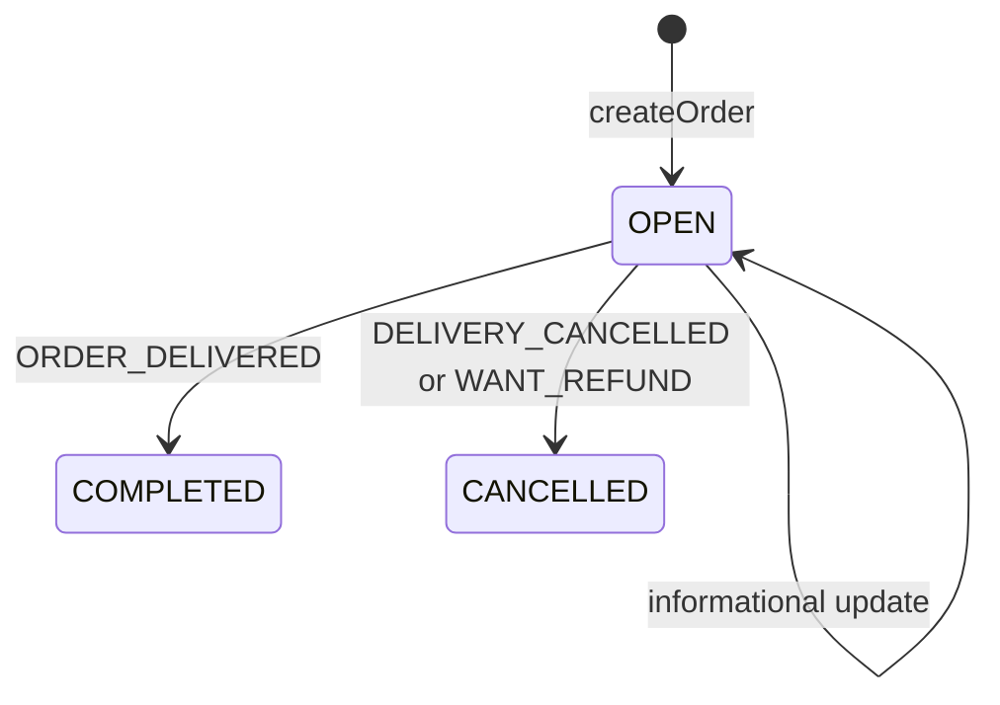

# Design Workflow Automation Engine in Python

#### Problem Statement
[https://codezym.com/question/98-design-workflow-automation-engine](https://codezym.com/question/98-design-workflow-automation-engine)

Every order in this problem is a small state machine. It starts `OPEN` and ends as `COMPLETED` or `CANCELLED`, and the result of a status update depends mostly on two things: the order's **current state** and the **status code**. That is exactly what the **State pattern** is for, so each state becomes a small class with its own rules. Refund percentages are business rules that change often, so we keep them in one place with the **Strategy pattern**. Using **State + Strategy together** is the cleanest design here: State handles the order lifecycle, Strategy handles the money.

We first build a simple if-else version so every rule is visible in one place. Then we look at its problems and improve it.

## Rules at a Glance

Every call to `updateOrderStatus()` starts with the same three lines: `ORDER:<orderId>`, `BY:<by>` and `STATUS:<statusCode>`. The lines after them depend on the current state and the status code.

In the table, "refund lines" means `ACTION:ISSUE_REFUND` followed by `REFUND_PERCENT:<percent>`.

| Current state | Status update | Result lines | New state |
|---|---|---|---|
| OPEN | any informational status | `ACTION:CONTINUE_ORDER` | OPEN |
| OPEN | `ORDER_DELIVERED` | `LATE:true/false`, `ACTION:COMPLETE_ORDER`, refund lines if 10+ minutes late | COMPLETED |
| OPEN | `DELIVERY_CANCELLED` | `ACTION:CANCEL_ORDER`, refund lines with 100 | CANCELLED |
| OPEN | `WANT_REFUND` | refund lines with 95 (preparation not started) or 100 (started), then `ACTION:CANCEL_ORDER` | CANCELLED |
| COMPLETED | `WANT_REFUND` | `ACTION:REFUND_ALREADY_ISSUED`, or refund lines based on stored lateness, or `ACTION:NO_REFUND_RULE_MATCH` | COMPLETED |
| COMPLETED | anything else | `ACTION:IGNORED_ORDER_ALREADY_CLOSED` | no change |
| CANCELLED | anything, even `WANT_REFUND` | `ACTION:IGNORED_ORDER_ALREADY_CLOSED` | no change |

The six informational statuses are `ORDER_GETTING_PREPARED`, `OUT_FOR_DELIVERY`, `RAIN_DELAY`, `DASHER_REACHED_DELIVERY_LOCATION`, `CUSTOMER_UNREACHABLE` and `DASHER_UNREACHABLE`. Only `ORDER_GETTING_PREPARED` changes something: it marks that preparation has started.

**Late delivery refund:** less than 10 minutes late gives no refund, 10 to 20 minutes gives 50%, more than 20 minutes gives 100%.

### Log Traps to Watch

The logic is simple, but the log lines are easy to get wrong.

1. `LATE:...` must come right after `STATUS:...`, so add it **before** `ACTION:COMPLETE_ORDER`.
2. `REFUND_PERCENT:...` must come right after `ACTION:ISSUE_REFUND`. We always write both lines from one helper, so they can never get separated.
3. Cancel and refund lines switch places. `DELIVERY_CANCELLED` logs `ACTION:CANCEL_ORDER` first, then the refund. `WANT_REFUND` on an open order logs the refund first, then `ACTION:CANCEL_ORDER`.
4. A repeated `WANT_REFUND` gets two different answers. A `COMPLETED` order replies `ACTION:REFUND_ALREADY_ISSUED`. A `CANCELLED` order replies `ACTION:IGNORED_ORDER_ALREADY_CLOSED`, because the refund decided at cancellation time is final.
5. Python turns booleans into `True` and `False`, but the log needs lowercase. So we write `"LATE:true"` and `"LATE:false"` as plain strings instead of using `str()`.

## Solution 1: Simple If-Else Version

### Idea

Store one `Order` object per order and write all the rules inside `updateOrderStatus()` as plain if-else blocks.

- **`orders` dict (`orderId -> Order`):** every update comes with an `orderId`, so we need a fast O(1) lookup from id to order.
- **`Order`:** besides the ids and `delivery_eta`, it remembers the current `state` and three facts that later updates need:
  - `preparation_started`: decides 95% vs 100% when the customer cancels.
  - `refund_issued`: makes sure an order never gets a second refund.
  - `minutes_late`: saved at delivery, so a later `WANT_REFUND` can reuse it.
- **`set` for users and restaurants:** the problem asks the system to keep them in memory. Inputs are always valid, so we never have to check them.

`updateOrderStatus()` writes the three header lines, then checks the state. An `OPEN` order reacts to the status code. A `COMPLETED` order only reacts to `WANT_REFUND`. Everything else is ignored, including every update on a `CANCELLED` order.

Two small helpers keep it tidy. `late_delivery_percent()` turns minutes late into a refund percent, and `issue_refund()` sets the flag and writes both refund lines together.

### Code

```python
class Order:
    """Everything we need to remember about one order."""

    def __init__(self, order_id, restaurant_id, user_id, delivery_eta):
        self.order_id = order_id
        self.restaurant_id = restaurant_id
        self.user_id = user_id
        self.delivery_eta = delivery_eta

        self.state = "OPEN"               # OPEN, COMPLETED or CANCELLED
        self.preparation_started = False  # decides 95% vs 100% on WANT_REFUND
        self.refund_issued = False        # at most one refund per order
        self.minutes_late = 0             # saved on delivery, reused by a later WANT_REFUND


class WorkflowAutomator:
    def __init__(self, existingUsers, existingRestaurants):
        self.users = set(existingUsers)
        self.restaurants = set(existingRestaurants)
        self.orders = {}  # orderId -> Order

    def createOrder(self, orderId, restaurantId, userId, deliveryETA, currentTime):
        self.orders[orderId] = Order(orderId, restaurantId, userId, deliveryETA)

    def updateOrderStatus(self, orderId, by, currentTime, statusCode):
        order = self.orders[orderId]
        logs = ["ORDER:" + orderId, "BY:" + by, "STATUS:" + statusCode]

        if order.state == "OPEN":
            if statusCode == "ORDER_DELIVERED":
                order.minutes_late = currentTime - order.delivery_eta
                # must come right after STATUS, and in lowercase
                logs.append("LATE:true" if order.minutes_late > 0 else "LATE:false")
                order.state = "COMPLETED"
                logs.append("ACTION:COMPLETE_ORDER")
                percent = self.late_delivery_percent(order.minutes_late)
                if percent > 0:
                    self.issue_refund(order, percent, logs)
            elif statusCode == "DELIVERY_CANCELLED":
                order.state = "CANCELLED"
                logs.append("ACTION:CANCEL_ORDER")
                self.issue_refund(order, 100, logs)
            elif statusCode == "WANT_REFUND":
                # customer cancels: refund first, then cancel
                self.issue_refund(order, 100 if order.preparation_started else 95, logs)
                order.state = "CANCELLED"
                logs.append("ACTION:CANCEL_ORDER")
            else:
                # informational update, the order stays OPEN
                if statusCode == "ORDER_GETTING_PREPARED":
                    order.preparation_started = True
                logs.append("ACTION:CONTINUE_ORDER")
        elif order.state == "COMPLETED" and statusCode == "WANT_REFUND":
            # the only update a closed order still reacts to
            if order.refund_issued:
                logs.append("ACTION:REFUND_ALREADY_ISSUED")
            else:
                # no refund yet: decide using the stored lateness
                percent = self.late_delivery_percent(order.minutes_late)
                if percent > 0:
                    self.issue_refund(order, percent, logs)
                else:
                    logs.append("ACTION:NO_REFUND_RULE_MATCH")
        else:
            # CANCELLED ignores every update (its refund is final),
            # COMPLETED ignores every non-refund update
            logs.append("ACTION:IGNORED_ORDER_ALREADY_CLOSED")
        return logs

    def late_delivery_percent(self, minutes_late):
        """Less than 10 minutes late: 0, 10 to 20 minutes: 50, more than 20 minutes: 100."""
        if minutes_late < 10:
            return 0
        if minutes_late <= 20:
            return 50
        return 100

    def issue_refund(self, order, percent, logs):
        """Marks the refund as issued and writes both refund lines together."""
        order.refund_issued = True
        logs.append("ACTION:ISSUE_REFUND")
        logs.append("REFUND_PERCENT:" + str(percent))
```

### What Is Wrong With This Version?

It gives the right answers, but it does not grow well.

1. **All rules sit in one big method.** Adding a new state (say `ON_HOLD`) or a new status means editing the same nested if-else and re-checking every branch. Fixing one rule can easily break another.
2. **Business numbers are mixed with flow logic.** The values 10, 20, 50, 95 and 100 are buried inside the state changes. Changing a refund rule means touching the code that moves orders between states.

The next solution fixes both problems.

## Solution 2: State Pattern + Strategy Pattern

### Why the State Pattern?

Look at the rules table again. Every row is "state + status gives behavior". The State pattern turns each state into its own class:

- `OpenState` knows how an open order reacts.
- `CompletedState` and `CancelledState` know how closed orders react.

`updateOrderStatus()` no longer checks the state at all. It just calls the current state object, and that object decides what happens and which state comes next. A new state is a new class, and the existing ones stay untouched.



Once an order leaves `OPEN`, its state never changes again. Only a `COMPLETED` order still reacts to `WANT_REFUND`. A `CANCELLED` order ignores everything.

### Why the Strategy Pattern for Refunds?

Part 2 of the problem is all about compensation amounts, and those are the rules most likely to change. Putting them behind a `RefundPolicy` base class means:

- State classes only ask "how much?". They never know the numbers.
- A new set of rules (for example, a holiday policy that pays 100% for any late order) is just a new class plugged in at one place.

### Patterns That Sound Good but Are Not the Best Fit

- **Chain of Responsibility:** a list of rule handlers where each one checks "is this update mine?". It sounds natural for an automation engine. But here the current state and the status code already tell us exactly which rule to run, so calling the state directly is simpler. A chain also makes handler order matter (the "order already closed" check must run before the "delivered" handler), which is an easy place for bugs.
- **Observer:** "react to status updates" sounds like events and listeners. But the caller needs the logs back right away and in a strict order, and there are no independent subscribers. An event system would only add moving parts.

### Classes

`OrderState` and `RefundPolicy` are plain base classes whose methods raise `NotImplementedError`. They act like interfaces: they only list the methods every subclass must provide.

**`Order`** holds the data, the current `state` object and the same three facts as before. It also owns `issue_refund()`. Because it is the only place a refund is issued, the `refund_issued` flag and the two refund log lines always stay in sync.

**`RefundPolicy` and `StandardRefundPolicy` (Strategy)** answer three questions:

- How much for a late delivery? `late_delivery_percent()`
- How much when the delivery is cancelled? `cancelled_delivery_percent()`
- How much when the customer cancels? `customer_cancel_percent()`

**`OrderState` (State)** has one method per kind of update: `on_info_update()`, `on_delivered()`, `on_delivery_cancelled()` and `on_refund_request()`. All six informational statuses share `on_info_update()`, which keeps the class small.

- **`OpenState`:** the only state that moves forward. It sets `preparation_started`, stores `minutes_late`, issues refunds and switches the order to `CompletedState` or `CancelledState`.
- **`ClosedState`:** a small base class for both closed states. It answers every non-refund update with `IGNORED_ORDER_ALREADY_CLOSED`, so that code is written once.
- **`CompletedState`:** on `WANT_REFUND`, it reports the existing refund or decides one from the stored `minutes_late`.
- **`CancelledState`:** ignores `WANT_REFUND` too, because the refund decided at cancellation time is final. So a cancelled order ignores every update.

**`WorkflowAutomator`** is the entry point. It writes the three header lines, sends the update to the matching state method and returns the logs. It holds no business rules itself.

### Walkthrough of Example 1

The order is created with `deliveryETA = 100`.

| Call | State before | What happens | State after |
|---|---|---|---|
| `OUT_FOR_DELIVERY` at 85 | OPEN | `on_info_update()` logs `CONTINUE_ORDER` | OPEN |
| `ORDER_DELIVERED` at 115 | OPEN | 15 minutes late: `LATE:true`, `COMPLETE_ORDER`, policy returns 50, refund issued | COMPLETED |
| `WANT_REFUND` at 120 | COMPLETED | `refund_issued` is true: `REFUND_ALREADY_ISSUED` | COMPLETED |
| `RAIN_DELAY` at 125 | COMPLETED | `ClosedState` logs `IGNORED_ORDER_ALREADY_CLOSED` | COMPLETED |

### Code

```python
class Order:
    """
    Everything we need to remember about one order.
    The 'state' object decides how the order reacts to the next status update.
    """

    def __init__(self, order_id, restaurant_id, user_id, delivery_eta, state):
        self.order_id = order_id
        self.restaurant_id = restaurant_id
        self.user_id = user_id
        self.delivery_eta = delivery_eta
        self.state = state

        self.preparation_started = False  # decides 95% vs 100% on WANT_REFUND
        self.refund_issued = False        # at most one refund per order
        self.minutes_late = 0             # saved on delivery, reused by a later WANT_REFUND

    def issue_refund(self, percent, logs):
        """The only place a refund is issued, so the flag and both log lines always stay together."""
        self.refund_issued = True
        logs.append("ACTION:ISSUE_REFUND")
        logs.append("REFUND_PERCENT:" + str(percent))


# ===== Strategy: refund rules =====

class RefundPolicy:
    """All compensation numbers live behind this interface."""

    def late_delivery_percent(self, minutes_late):
        raise NotImplementedError

    def cancelled_delivery_percent(self):
        raise NotImplementedError

    def customer_cancel_percent(self, preparation_started):
        raise NotImplementedError


class StandardRefundPolicy(RefundPolicy):
    """The refund rules from the problem statement."""

    def late_delivery_percent(self, minutes_late):
        if minutes_late < 10:
            return 0
        if minutes_late <= 20:
            return 50
        return 100

    def cancelled_delivery_percent(self):
        return 100

    def customer_cancel_percent(self, preparation_started):
        return 100 if preparation_started else 95


# ===== State: order lifecycle =====

class OrderState:
    """Every state answers the same 4 kinds of updates, each in its own way."""

    def on_info_update(self, order, status_code, logs):
        raise NotImplementedError

    def on_delivered(self, order, current_time, logs):
        raise NotImplementedError

    def on_delivery_cancelled(self, order, logs):
        raise NotImplementedError

    def on_refund_request(self, order, logs):
        raise NotImplementedError


class OpenState(OrderState):
    """OPEN: the only state where an order can still move forward."""

    def __init__(self, refund_policy):
        self.refund_policy = refund_policy

    def on_info_update(self, order, status_code, logs):
        if status_code == "ORDER_GETTING_PREPARED":
            order.preparation_started = True
        logs.append("ACTION:CONTINUE_ORDER")

    def on_delivered(self, order, current_time, logs):
        order.minutes_late = current_time - order.delivery_eta
        # must come right after STATUS, and in lowercase
        logs.append("LATE:true" if order.minutes_late > 0 else "LATE:false")
        order.state = CompletedState(self.refund_policy)
        logs.append("ACTION:COMPLETE_ORDER")

        percent = self.refund_policy.late_delivery_percent(order.minutes_late)
        if percent > 0:
            order.issue_refund(percent, logs)

    def on_delivery_cancelled(self, order, logs):
        order.state = CancelledState()
        logs.append("ACTION:CANCEL_ORDER")
        order.issue_refund(self.refund_policy.cancelled_delivery_percent(), logs)

    def on_refund_request(self, order, logs):
        # customer cancels: refund first, then cancel
        order.issue_refund(self.refund_policy.customer_cancel_percent(order.preparation_started), logs)
        order.state = CancelledState()
        logs.append("ACTION:CANCEL_ORDER")


class ClosedState(OrderState):
    """Shared by COMPLETED and CANCELLED: every non-refund update is ignored."""

    def on_info_update(self, order, status_code, logs):
        logs.append("ACTION:IGNORED_ORDER_ALREADY_CLOSED")

    def on_delivered(self, order, current_time, logs):
        logs.append("ACTION:IGNORED_ORDER_ALREADY_CLOSED")

    def on_delivery_cancelled(self, order, logs):
        logs.append("ACTION:IGNORED_ORDER_ALREADY_CLOSED")


class CompletedState(ClosedState):
    """COMPLETED: a refund request is checked against the stored lateness."""

    def __init__(self, refund_policy):
        self.refund_policy = refund_policy

    def on_refund_request(self, order, logs):
        if order.refund_issued:
            logs.append("ACTION:REFUND_ALREADY_ISSUED")
            return
        percent = self.refund_policy.late_delivery_percent(order.minutes_late)
        if percent > 0:
            order.issue_refund(percent, logs)
        else:
            logs.append("ACTION:NO_REFUND_RULE_MATCH")


class CancelledState(ClosedState):
    """CANCELLED: final. It ignores every update, even WANT_REFUND."""

    def on_refund_request(self, order, logs):
        # the refund decided at cancellation time is final, so this request is ignored too
        logs.append("ACTION:IGNORED_ORDER_ALREADY_CLOSED")


# ===== Entry point =====

class WorkflowAutomator:
    def __init__(self, existingUsers, existingRestaurants):
        self.users = set(existingUsers)
        self.restaurants = set(existingRestaurants)
        self.orders = {}  # orderId -> Order
        self.refund_policy = StandardRefundPolicy()

    def createOrder(self, orderId, restaurantId, userId, deliveryETA, currentTime):
        # every new order starts OPEN
        self.orders[orderId] = Order(orderId, restaurantId, userId, deliveryETA, OpenState(self.refund_policy))

    def updateOrderStatus(self, orderId, by, currentTime, statusCode):
        order = self.orders[orderId]
        logs = ["ORDER:" + orderId, "BY:" + by, "STATUS:" + statusCode]  # 'by' only affects logs

        # hand the update to the current state, the state decides what happens
        if statusCode == "ORDER_DELIVERED":
            order.state.on_delivered(order, currentTime, logs)
        elif statusCode == "DELIVERY_CANCELLED":
            order.state.on_delivery_cancelled(order, logs)
        elif statusCode == "WANT_REFUND":
            order.state.on_refund_request(order, logs)
        else:
            # ORDER_GETTING_PREPARED, OUT_FOR_DELIVERY, RAIN_DELAY and other informational updates
            order.state.on_info_update(order, statusCode, logs)
        return logs
```

## Complexity

- **Time:** `createOrder()` and `updateOrderStatus()` are both O(1): one dict lookup plus a fixed number of log lines.
- **Space:** O(U + R + N) for U users, R restaurants and N orders.