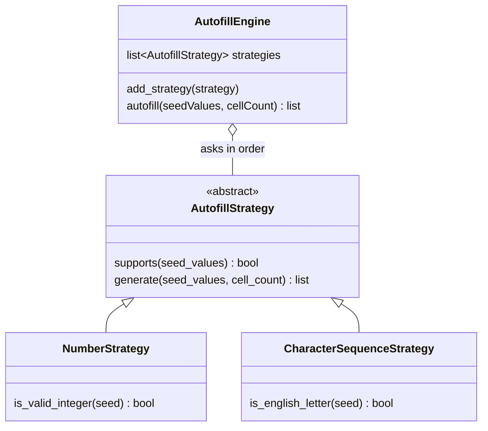

# Design an Extensible Excel-Like Autofill Engine in Python

#### Problem Statement
[https://codezym.com/question/320-excel-like-autofill-engine](https://codezym.com/question/320-excel-like-autofill-engine)

When you drag a cell in Excel, it looks at the starting values and decides how to continue them. `12` continues as `13, 14, 15`, while `p, Q, r` simply repeats. Every fill type does the same two jobs: check whether it understands the seeds, then generate the values.

That is exactly what the **Strategy pattern** is made for. Each fill type becomes its own small class with two methods, `supports()` and `generate()`. The engine keeps a list of these strategies, asks them one by one and lets the first one that says yes do the work.

Strategy alone is the best fit here. A simple list handles the selection, so we do not need a Factory or a Chain of Responsibility on top of it. Adding dates, weekdays or Fibonacci later means writing one new class and registering it, while the selection logic and the existing strategies stay untouched.

We will start with a plain if-else version, see where it breaks down, and then refactor it into the Strategy pattern.

## The Rules in Short

| Fill type | Accepted seeds | Output |
|---|---|---|
| `NUMBER` | exactly one valid integer | `seed, seed+1, seed+2, ...` |
| `CHARACTER_SEQUENCE` | one or more seeds, each a single letter from `a-z` or `A-Z` | the seeds repeated in the same order |

In both cases the output has exactly `cellCount` values and starts with the seeds themselves.

If no fill type accepts the **whole** list, the answer is an empty list.

The only tricky part is deciding what counts as a valid integer:

| Seed | Valid number? | Why |
|---|---|---|
| `"12"`, `"-3"`, `"0"` | Yes | plain integers |
| `"+5"` | No | a plus sign is not allowed |
| `"01"` | No | leading zero |
| `"-0"` | No | negative zero |
| `"1.5"`, `" 5"` | No | not a plain integer |
| `"1000000001"` | No | outside `-1,000,000,000` to `1,000,000,000` |

## Approach 1: One Class With If-Else

The most direct solution puts everything inside `autofill()`. First check if the seeds look like a number. If not, check if they are all letters. Otherwise return an empty list.

```python
class AutofillEngine:
    def __init__(self):
        pass

    def autofill(self, seedValues, cellCount):
        if not seedValues:
            return []

        # Fill type 1: a single number that counts up
        if len(seedValues) == 1 and self.is_valid_integer(seedValues[0]):
            start = int(seedValues[0])
            return [str(start + i) for i in range(cellCount)]

        # Fill type 2: a repeating pattern of letters
        if self.all_english_letters(seedValues):
            return [seedValues[i % len(seedValues)] for i in range(cellCount)]

        # Every new fill type needs one more if-block above this line
        return []

    def is_valid_integer(self, seed):
        if not seed:
            return False
        digits = seed[1:] if seed.startswith("-") else seed
        if len(digits) == 0 or len(digits) > 10:
            return False
        for c in digits:
            if c < "0" or c > "9":
                return False
        if digits[0] == "0" and seed != "0":
            return False
        return -1_000_000_000 <= int(seed) <= 1_000_000_000

    def all_english_letters(self, seed_values):
        for seed in seed_values:
            if not seed or len(seed) != 1:
                return False
            if not ("a" <= seed <= "z" or "A" <= seed <= "Z"):
                return False
        return True
```

### Problems With This Approach

It works, but think about what happens when we add dates, weekdays and Fibonacci.

- **The method keeps growing.** Every new fill type is one more if-block inside `autofill()`.
- **One class does every job.** It picks the fill type, validates every format and generates the values. A small change to the number rules can break letter filling by mistake.
- **Hard to test.** You cannot test one fill type on its own.
- **It breaks the main requirement.** New fill types must be added without changing the selection logic or any existing strategy. Here, every new type edits `autofill()`.

## Approach 2: Strategy Pattern

Look at the if-else code again. Each block does the same two things: **check** if the seeds fit, and if they do, **generate** the values. Only the details change.

So we move each block into its own class with a common parent. That is the Strategy pattern: one job (filling cells), many interchangeable ways of doing it.

### The Classes

**1. `AutofillStrategy` (abstract base class)**

The contract every fill type follows:

- `supports(seed_values)` returns `True` only if **every** seed is valid for this fill type.
- `generate(seed_values, cell_count)` returns exactly `cell_count` values.

Python has no `interface` keyword, so we use an abstract base class (`ABC`) with `@abstractmethod`. If a strategy forgets one of the two methods, Python refuses to create it, so the mistake shows up early.

The engine calls `generate()` only after `supports()` returns `True`. So a strategy always validates all seeds before generating anything, and a list like `["a", "b", "1"]` is rejected as a whole.

We need this base class because the engine only talks to it. The engine never needs to know which fill types exist.

**2. `NumberStrategy`**

Accepts exactly one valid integer and counts up from it. Its `is_valid_integer()` check works in four steps:

1. Remove an optional leading `-`.
2. What is left must be 1 to 10 characters long, and every character must be a digit `0` to `9`. A `+` fails here.
3. If it starts with `0`, the whole seed must be exactly `"0"`. This one rule rejects both `"01"` and `"-0"`.
4. Convert it with `int()` and check the range.

Why not just call `int()` and catch the error? It is too forgiving. It happily accepts `"+5"`, `"007"`, `"-0"`, `" 5 "` and even `"1_000"`, which the rules reject. So we check the format ourselves and use `int()` only to read the value.

We compare against `"0"` to `"9"` directly because `str.isdigit()` also accepts characters like `"²"`. Checking the length first also means `int()` never has to read a huge string.

A valid seed is always written in its normal form, so `str(start)` gives back the exact seed. That is why the first generated value always equals the seed.

**3. `CharacterSequenceStrategy`**

Accepts a list where every seed is exactly one English letter. It repeats the seeds using `i % len(seed_values)`. For 3 seeds this gives `0, 1, 2, 0, 1, 2, ...`, so it jumps back to the first seed after the last one.

Seeds go into the output exactly as given, so `"Q"` stays `"Q"`. We compare with `a-z` and `A-Z` directly because `str.isalpha()` would also accept letters like `é`.

**4. `AutofillEngine`**

Holds a plain list of strategies. It asks each strategy in order, and the first one that supports the seeds generates the result. If none does, it returns an empty list.

Why a list? We only need to keep the strategies in a fixed order and walk through them. The order also acts as the priority if two future strategies ever accept the same seeds. For today's two strategies the order does not matter, because no seed can be both a valid integer and a letter.

`autofill()` keeps the parameter names from the problem's method signature. Everything else follows normal Python naming.

### Class Diagram



### How a Call Flows

For `autofill(["p", "Q", "r"], 8)`:

1. `NumberStrategy.supports()` returns `False` because there is more than one seed.
2. `CharacterSequenceStrategy.supports()` returns `True` because every seed is a single letter.
3. It generates `["p", "Q", "r", "p", "Q", "r", "p", "Q"]`.

For `autofill(["A", "2"], 6)`, both strategies return `False`, so the engine returns `[]`.

### Adding a New Fill Type

Say we want weekdays (`Mon, Tue, Wed, ...`):

1. Create `class WeekdayStrategy(AutofillStrategy)`.
2. Write its own `supports()` and `generate()`.
3. Add it to the list in `__init__()`, or plug it in from outside with `add_strategy()`.

`autofill()`, `NumberStrategy` and `CharacterSequenceStrategy` stay exactly as they are.

### Why Not Simple Factory or Chain of Responsibility?

**Simple Factory:** a factory could look at the seeds and return the right strategy. But to choose, it needs an if-else that knows the rules of every fill type. Each new type means editing the factory, which is the same problem as Approach 1. In our design each strategy checks its own seeds, so nothing central has to change.

**Chain of Responsibility:** each strategy could keep a link to the next one and pass the seeds along when it cannot handle them. That gives the same "first one that can handle it wins" result. But now every strategy has to manage a `next` link, and someone has to wire the chain together. A plain list with a loop does the same job with less code.

### How It Follows SOLID

| Principle | In this design |
|---|---|
| Single Responsibility | Each strategy handles one fill type. The engine only picks a strategy. |
| Open/Closed | A new fill type is a new class plus one registration line. The selection logic and existing strategies are never edited. |
| Liskov Substitution | Any strategy works wherever an `AutofillStrategy` is expected. |
| Interface Segregation | The base class has only the two methods every strategy needs. |
| Dependency Inversion | `autofill()` works only with the `AutofillStrategy` methods, never with concrete classes. |

### Complexity

Let `n` be `cellCount`.

- **Validation:** every seed is read at most once per strategy, so it is linear in the total length of the seeds. With at most 100 short seeds, this is tiny.
- **Generation:** `O(n)`, one step per cell.
- **Space:** `O(n)` for the returned list.

## Python Code

```python
from abc import ABC, abstractmethod


class AutofillStrategy(ABC):
    """
    One fill type of the autofill engine.
    Each strategy decides on its own which seeds it accepts and how to continue them.
    """

    @abstractmethod
    def supports(self, seed_values):
        """Returns True only if every seed value is valid for this strategy."""

    @abstractmethod
    def generate(self, seed_values, cell_count):
        """Returns exactly cell_count values. Called only if supports() is True."""


class NumberStrategy(AutofillStrategy):
    """
    NUMBER strategy: exactly one integer seed, then +1 for every next cell.
    Example: ["12"] gives 12, 13, 14, ...
    """

    def __init__(self):
        self.min_seed = -1_000_000_000
        self.max_seed = 1_000_000_000

    def supports(self, seed_values):
        if not seed_values or len(seed_values) != 1:
            return False
        return self.is_valid_integer(seed_values[0])

    def generate(self, seed_values, cell_count):
        start = int(seed_values[0])
        return [str(start + i) for i in range(cell_count)]

    def is_valid_integer(self, seed):
        """
        Valid: "0", "12", "-3".
        Invalid: "+5", "01", "-0", "1.5", or anything outside the allowed range.
        """
        if not seed:
            return False

        # An optional minus sign is allowed.
        # A plus sign is not, so it fails the digit check below.
        digits = seed[1:] if seed.startswith("-") else seed

        # At least one digit and at most 10, because 1,000,000,000 has 10 digits
        if len(digits) == 0 or len(digits) > 10:
            return False

        # Only plain digits 0 to 9 (str.isdigit() also accepts superscript digits)
        for c in digits:
            if c < "0" or c > "9":
                return False

        # No leading zero, unless the whole seed is "0". This also rejects "-0".
        if digits[0] == "0" and seed != "0":
            return False

        value = int(seed)
        return self.min_seed <= value <= self.max_seed


class CharacterSequenceStrategy(AutofillStrategy):
    """
    CHARACTER_SEQUENCE strategy: every seed is one English letter.
    The seeds form a repeating pattern.
    Example: ["p", "Q", "r"] gives p, Q, r, p, Q, r, ...
    """

    def supports(self, seed_values):
        if not seed_values:
            return False

        # Check every seed before generating anything
        for seed in seed_values:
            if not self.is_english_letter(seed):
                return False
        return True

    def generate(self, seed_values, cell_count):
        # i % size goes 0, 1, 2, 0, 1, 2, ... restarting after the last seed
        size = len(seed_values)
        return [seed_values[i % size] for i in range(cell_count)]

    def is_english_letter(self, seed):
        """Exactly one character from a-z or A-Z (no accented letters)."""
        if not seed or len(seed) != 1:
            return False
        return "a" <= seed <= "z" or "A" <= seed <= "Z"


class AutofillEngine:
    def __init__(self):
        # Strategies are asked in this order.
        # The first one that supports the seeds does the work.
        # Built-in strategies: NUMBER and CHARACTER_SEQUENCE
        self.strategies = [NumberStrategy(), CharacterSequenceStrategy()]

    def add_strategy(self, strategy):
        """Plugs in a new fill type without changing any existing code."""
        self.strategies.append(strategy)

    def autofill(self, seedValues, cellCount):
        for strategy in self.strategies:
            if strategy.supports(seedValues):
                return strategy.generate(seedValues, cellCount)
        # No strategy understands these seeds
        return []
```