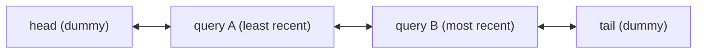

# Design Recent User Query LRU Cache in Java

#### Problem Statement

[https://codezym.com/question/455-recent-user-query-lru-cache](https://codezym.com/question/455-recent-user-query-lru-cache)

The core idea is to give two simple data structures two separate jobs: a `HashMap` finds a query quickly, and a doubly linked list keeps queries in the order they were last used. Whenever we insert, update, or successfully retrieve a query, we move it to the most recently used end. When space is needed, we remove the query at the least recently used end. This gives both methods `O(1)` average time. No additional design pattern is needed because the problem has one fixed eviction rule.

## What Do We Need to Build?

`RecentQueryCache` stores a result for each query, up to a fixed `capacity`.

- `storeQueryResult(query, result)` inserts a new query or replaces an existing result. Either action makes that query the most recently used query.
- `getQueryResult(query)` returns the stored result and makes the query most recently used. If the query is absent, it returns `""` and leaves the usage order unchanged.
- Inserting a new query into a full cache removes exactly one least recently used query.

**Least recently used means the query whose latest successful read, insertion, or update happened earliest.** It does not mean the least frequently used query.

An update does not consume another cache slot. Queries are case-sensitive, and queries and results must remain exactly as supplied, including any leading or trailing spaces. The empty string is reserved for a cache miss.

The capacity can be as large as `100,000`. Both methods must take `O(1)` average time, with `O(capacity)` space.

## Start with a Simple List

Imagine keeping query-result pairs in a list, ordered from least recently used to most recently used.

To retrieve a query, search the list. If it is present, move its entry to the end and return its result. To store a query, search for it first. Update and move an existing entry, or add a new entry at the end. If the list becomes too large, remove its first entry.

This follows the cache rules, but finding an entry can require scanning the entire list. With `C` cached queries, an operation can take `O(C)` time. An `ArrayList` also needs to shift later entries when an entry is removed from the beginning or middle.

The useful idea is the order of the list. We need a faster way to find and move an entry within that order.

## Improve the Lookup with a Map

A `HashMap` can find an entry by its query in `O(1)` average time.

However, a plain map does not track which entry was used least recently. We could store a last-used counter with each entry, but finding the smallest counter when the cache is full would require a scan.

We therefore keep the map for lookup and keep a list for usage order. The remaining requirement is to remove a known entry from anywhere in that list in constant time.

## Final Approach: HashMap and Doubly Linked List

### Why Use a Doubly Linked List?

Each node in a doubly linked list holds a reference to both its previous node and its next node.

Once we have the node, removing it takes only two changes: make its previous neighbor point to its next neighbor, and make its next neighbor point back to its previous neighbor. No search or shifting is needed.

The map stores a reference to each query's node, so we can find the node and then move it in constant time.

Calling `remove(value)` on Java's ordinary `LinkedList` would still need to search for that value. A small private `Node` class gives our map direct access to the nodes that we need to move.

### What Does Each Part Store?

**`Node`** stores one query, its result, and its two neighbor references. We keep the query inside the node because eviction starts from the list: after choosing a node to remove, we need its query to remove the matching map entry. The query stays fixed while the result can be updated.

**`Map<String, Node> nodes`**, backed by a `HashMap`, finds a node by its query. Each map entry points to the same node that appears in the list. There is only one node for each cached query.

**`head` and `tail`** are two dummy nodes that mark the ends of the list. They hold no cached query and do not count toward capacity. They let us use the same insertion and removal steps even when the cache contains only one real node.

We keep the real nodes in order from least recently used to most recently used:



For a nonempty cache, `head.next` is the least recently used node, and `tail.previous` is the most recently used node. When the cache is empty, the two dummy nodes point directly to each other.

### Why No Additional Design Pattern?

The list already records everything needed to apply LRU. A Strategy pattern would be useful if callers could choose between different eviction rules, but this problem always requires LRU. Adding an eviction interface and extra strategy classes would add code without changing the required behavior or improving its running time.

`RecentQueryCache` therefore owns the map and list directly. The private `Node` class is just a small holder for one entry and its neighbors.

## How the Methods Work

### Retrieving a Query

1. Look up the query in the map.
2. If it is absent, return `""` immediately. Do not change the list.
3. If it is present, remove its node from its current position and insert it just before `tail`.
4. Return the node's result.

A successful read counts as a use, even though it does not change the stored result.

### Storing or Updating a Query

First, look up the query in the map.

If it already exists, replace its result, move its node just before `tail`, and return. Returning here matters: an update does not add an entry and must not evict another query.

If the query is new, check whether the cache is full. If it is, remove `head.next` from both the list and the map. Then create the new node, put it in the map, and insert it just before `tail`.

Removing the old entry immediately before inserting the new one gives the required final state while keeping the stored entry count within capacity. The capacity is at least one, so a full cache always has a real node to remove.

### The Three Small List Helpers

`removeNode` connects a node's two neighbors to each other. It only changes list links. The calling method decides whether the map entry should also be removed.

`addAsMostRecent` inserts a new or detached node just before `tail`.

`moveToMostRecent` calls those two helpers in sequence. This works even when the node is already the most recent one or is the only real node in the cache.

## Walk Through an Example

Let the capacity be `2`. In the orders below, the first query is least recently used and the last query is most recently used.

1. Store `("electric cars", "Initial result")`. The order is `["electric cars"]`.
2. Store `("battery laptops", "Laptop result")`. The order is `["electric cars", "battery laptops"]`.
3. Store `("electric cars", "Updated result")`. This updates the existing node and moves it to the end. The order becomes `["battery laptops", "electric cars"]`. The cache still has two entries.
4. Store `("water purifier", "Purifier result")`. The cache is full, so remove `"battery laptops"`. The order becomes `["electric cars", "water purifier"]`.
5. Retrieve `"electric cars"`. Return `"Updated result"` and change the order to `["water purifier", "electric cars"]`.
6. Retrieve `"battery laptops"`. Return `""`. The order stays `["water purifier", "electric cars"]`.

No timestamps are needed. Moving a node to the end records its latest use directly.

## Why This Produces the Correct Result

The implementation maintains three rules after every public method call:

1. Every cached query has exactly one node in the map and exactly one matching node in the list.
2. The real nodes are ordered from least recently used to most recently used.
3. The number of cached queries never exceeds `capacity`.

These rules hold initially because neither structure contains any cached queries.

A failed retrieval changes neither structure, so all three rules continue to hold. A successful retrieval or an update moves only the affected node to the most recent end. Its latest use is now the newest, while the relative order of the other nodes stays the same. An update also replaces the result stored in that same node.

For a new query, we remove the first real node if the cache is full. Because the list is ordered by most recent use, that node is exactly the least recently used query. Removing it from both structures preserves their agreement and creates one free slot. Adding the new node to both structures at the most recent end preserves all three rules.

Therefore, lookups return the latest stored result, and every eviction removes the correct query.

## Time and Space Complexity

Let `C` be the cache capacity.

**`getQueryResult`: `O(1)` average time.** It performs a map lookup and, on a hit, a fixed number of list-link changes.

**`storeQueryResult`: `O(1)` average time.** It performs a constant number of map operations and list-link changes. Hash-map resizing can make an individual insertion slower. Its cost is spread across insertions, giving amortized constant time under the usual average-case hashing assumption.

**Space: `O(C)`.** The map holds at most `C` entries, and the list holds at most `C` real nodes plus two dummy nodes. Moving an entry reuses its existing node, so repeated reads and updates do not accumulate extra entries.

These bounds treat the problem's bounded strings as constant-sized: queries have at most `200` characters and results at most `1,000`. If query length were an additional unbounded variable, hashing or comparing a query could also take time proportional to its length.

## Java Implementation

```java
import java.util.HashMap;
import java.util.Map;

public class RecentQueryCache {

    /** One cached query and its position in the usage-order list. */
    private static class Node {
        private final String query;
        private String result;
        private Node previous;
        private Node next;

        private Node(String query, String result) {
            this.query = query;
            this.result = result;
        }
    }

    private final int capacity;
    private final Map<String, Node> nodes;
    private final Node head;
    private final Node tail;

    public RecentQueryCache(int capacity) {
        this.capacity = capacity;
        this.nodes = new HashMap<>();

        // Dummy nodes simplify changes at both ends of the list.
        this.head = new Node(null, null);
        this.tail = new Node(null, null);
        head.next = tail;
        tail.previous = head;
    }

    public void storeQueryResult(String query, String result) {
        Node node = nodes.get(query);

        if (node != null) {
            node.result = result;
            moveToMostRecent(node);
            return; // Updating an entry must not trigger eviction.
        }

        if (nodes.size() == capacity) {
            Node leastRecent = head.next;
            removeNode(leastRecent);
            nodes.remove(leastRecent.query);
        }

        Node newNode = new Node(query, result);
        nodes.put(query, newNode);
        addAsMostRecent(newNode);
    }

    public String getQueryResult(String query) {
        Node node = nodes.get(query);

        if (node == null) {
            return ""; // A miss leaves the usage order unchanged.
        }

        moveToMostRecent(node);
        return node.result;
    }

    private void moveToMostRecent(Node node) {
        removeNode(node);
        addAsMostRecent(node);
    }

    /** Detaches a real node without changing the map. */
    private void removeNode(Node node) {
        node.previous.next = node.next;
        node.next.previous = node.previous;
    }

    /** Inserts a new or detached node immediately before tail. */
    private void addAsMostRecent(Node node) {
        Node previousMostRecent = tail.previous;

        node.previous = previousMostRecent;
        node.next = tail;
        previousMostRecent.next = node;
        tail.previous = node;
    }
}
```
