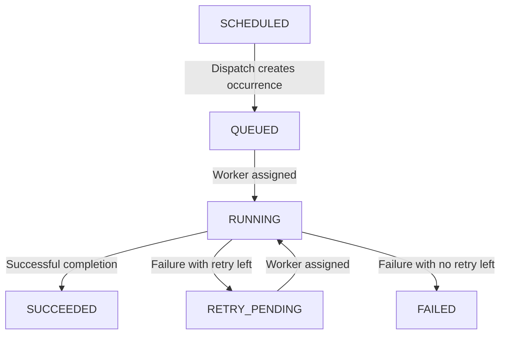

# Design Cron Job Scheduler in Java

#### Problem Statement

[https://codezym.com/question/456-cron-job-scheduler](https://codezym.com/question/456-cron-job-scheduler)

The core idea is to store a job's schedule separately from each occurrence of that job. Maps help us find jobs and occurrences quickly. Sorted sets help us choose the next due occurrence, the next waiting occurrence, and the first available worker in the required order. Each occurrence keeps its own status and attempt number, which makes retries and duplicate prevention straightforward. No formal design pattern or combination of patterns is needed here. Two small classes and an enum are enough for this fixed set of rules.

## 1. Understand jobs, occurrences, and attempts

These three things represent different levels of work.

A **job** stores the schedule. For example, `inventory-sync` might start at second `10` and repeat every `5` seconds.

An **occurrence** is one scheduled run of that job. This job has occurrences at `10`, `15`, `20`, and so on. Each occurrence is identified by its job ID and its original scheduled time.

An **attempt** is one assignment of an occurrence to a worker. If the occurrence scheduled at `10` fails and gets a retry, it is still the occurrence scheduled at `10`. Its attempt number changes from `1` to `2`.

This separation matters because the occurrence at `10` can be retrying while the occurrence at `15` runs on another worker. They must not share one job-level status or attempt counter.

For a one-time job, the interval is `0` and there is only one occurrence.

## 2. Start with a simple approach

We could store jobs and occurrences in maps, then do the following on every `dispatchJobs` call.

1. Scan every job and create its due occurrences, remembering which scheduled times have already been created.
2. Scan every created occurrence and collect those waiting for a first attempt or retry.
3. Sort those pending occurrences by scheduled time and then job ID.
4. Collect and sort the available workers.
5. Pair the first pending occurrence with the first available worker until one list runs out.

This approach can produce the correct result. The problem is the repeated scanning and sorting.

The scheduler can contain up to `100,000` jobs and create up to `200,000` occurrences. A dispatch call might have nothing new to do, yet the simple approach would still inspect many unrelated jobs and completed occurrences.

We can keep the same idea while maintaining the required order as data changes.

## 3. Keep maps for lookup and sorted sets for ordering

We use Java's `TreeSet` as a sorted set. We only need to insert an item, inspect the smallest item, and remove the smallest item. There is no need for a sorted map or range-query logic.

### Find jobs and their occurrences with maps

`Map<String, Job> jobs` finds a job by ID. It also lets us reject duplicate job IDs quickly.

Each `Job` contains a `Map<Long, Occurrence> occurrences`. Since the surrounding job already identifies the job ID, this inner map only needs the scheduled time as its key.

For example, completing `inventory-sync` at scheduled time `10` needs two lookups. First find the job, then find its occurrence at `10`.

The inner map stores only occurrences that `dispatchJobs` has created. We do not create an unlimited list of future runs for a recurring job.

### Keep one next occurrence time per job

`TreeSet<Job> futureJobs` orders jobs by their next uncreated occurrence time, then by job ID.

The name means an occurrence that still needs to be created. That time can already be overdue if dispatch has not been called recently.

For a job starting at `10` with interval `5`, we initially store only its next time, `10`. After creating that occurrence, we move its next time to `15`. Later, it moves to `20`.

This lets us inspect the earliest uncreated time directly. If that time is greater than the current time, no other job has an occurrence that needs to be created yet.

The job ID breaks ties. Without that tie-breaker, a sorted set would treat different jobs with the same next time as equal and keep only one of them.

### Put first attempts and retries in the same sorted set

`TreeSet<Occurrence> pendingOccurrences` contains occurrences in either `QUEUED` or `RETRY_PENDING` state.

Its order is the original scheduled time, followed by the job ID.

A retry does not get a new scheduled time. For example, a retry for time `10` comes before a first attempt for time `15`. At the same time, job `alpha` comes before job `beta`, regardless of which one is retrying.

This set does not contain running or finished occurrences. Dispatch removes an occurrence before assigning it. An accepted failure adds it back only when another retry is allowed.

### Track registered and available workers separately

`Set<String> registeredWorkers` contains every registered worker, including busy workers. It prevents someone from registering an existing busy worker again.

`TreeSet<String> availableWorkers` contains only workers that can accept an assignment. Its smallest ID is the next worker to use.

Dispatch removes the chosen worker from this set. An accepted completion adds the worker back.

We do not need a separate `Worker` class because the problem only requires its ID and availability. The running occurrence records which worker is executing it.

## 4. Keep the classes small

The `Job` class owns the schedule, retry limit, next uncreated time, and map of created occurrences. Its `hasScheduledTime` method answers whether a time belongs to the schedule.

The `Occurrence` class owns the status, number of attempts already dispatched, and currently assigned worker. It also refers to its job and stores its original scheduled time.

The `Status` enum represents the five stored states. `SCHEDULED` is returned when a valid occurrence time has no stored occurrence yet, so it does not need an enum value.

The **State pattern** might sound suitable because statuses change. Here, however, the states have only a few fixed transitions and no separate state-specific services. Creating a class for every state would add several classes around a short piece of logic. An enum and the checks in `completeJob` keep the rules together.

## 5. Follow the occurrence lifecycle



An occurrence can move from `SCHEDULED` through `QUEUED` to `RUNNING` in the same dispatch call when a worker is available.

`SUCCEEDED` and `FAILED` are final states. Those occurrences remain stored for status queries, but they never enter the pending set again.

## 6. Implement each method

### Register a worker

Reject an ID when it is blank or already registered. Otherwise, add it to both worker sets.

Use `isBlank()` for validation and store the original string. Do not trim it. For example, `" worker-a "` and `"worker-a"` are different IDs.

This method does not change the scheduler's time.

### Schedule a job

First update the scheduler's current time. Then reject a blank ID, an existing job ID, or a first run earlier than that time.

For an accepted job, add a `Job` to the lookup map and the set of next occurrence times. Its next time starts at its first run time.

Scheduling does not create an occurrence, even when the first run equals the current time. Creation belongs to `dispatchJobs`.

### Dispatch in two phases

**Phase one creates every due occurrence.** While the earliest uncreated time is at or before the current time, remove its job from `futureJobs` and create the occurrence in `QUEUED` state. Store it in the job's occurrence map and add it to the pending set.

If the job repeats, advance its next time by its interval and put the job back into `futureJobs`. For a one-time job, leave it out of that set. The job still remains in the lookup map.

Continue until all due occurrences have been created, even if no workers exist or every worker is busy. Otherwise, a due occurrence could incorrectly remain `SCHEDULED` after a dispatch call.

**Phase two assigns workers.** While both the pending set and available worker set are nonempty, remove the smallest item from each. Increase the occurrence's attempt number, mark it `RUNNING`, and remember its worker.

Append the assignment string to the result immediately, so the returned list preserves the assignment order.

The attempt counter starts at `0` because no attempt has been dispatched yet. The first assignment changes it to `1`. A pending retry receives its next attempt number when it is assigned again.

### Accept only the currently running attempt

`completeJob` first updates the current time, then finds the job and its stored occurrence.

Reject the report if the occurrence does not exist, is not `RUNNING`, or has a different attempt number. Perform all these checks before releasing the worker or changing the status.

Once the report is accepted, free the worker and apply the result.

- A successful attempt changes the status to `SUCCEEDED`.
- A failed attempt with another retry available changes the status to `RETRY_PENDING` and returns the occurrence to the pending set.
- A failed attempt with no retries left changes the status to `FAILED`.

The maximum attempt number is `maxRetries + 1`. Therefore, another attempt is allowed after a failure exactly when the current attempt number is less than that limit.

For example, `maxRetries = 1` permits attempts `1` and `2`. If attempt `2` fails, the occurrence becomes `FAILED`.

An accepted report returns `true`, including when it reports failure. This boolean says that the report was accepted. It does not say that the job succeeded.

Completion never assigns another attempt automatically. A later `dispatchJobs` call does that, and it may use the same current time.

### Read status without creating anything

For a one-time job, only its first run time belongs to its schedule.

For a recurring job, a time belongs to its schedule when it is at least the first run time and the difference is divisible by the interval. Check the zero-interval case before using the remainder operator.

Return an empty string for an unknown job or an invalid occurrence time.

For a valid scheduled time, return the stored occurrence's status if it exists. Otherwise, return `SCHEDULED`.

This remains true even when the requested occurrence is overdue. Advancing time alone does not create occurrences.

## 7. Details that prevent subtle bugs

**Update time before validation.** Every method receiving `currentTimeInSeconds` calls `advanceTime` first. A rejected scheduling request, rejected completion, or empty status result still updates the clock. Input times are guaranteed to be nondecreasing, so no extra backward-time policy is needed.

**Remove a job before changing its sort key.** `futureJobs` uses `nextRunTimeInSeconds` to order jobs. Changing that field while its job is inside the set would break the ordering. The code removes the job first, changes the time, and then inserts it again.

**Advance from the scheduled time.** A recurring job scheduled for `10`, `15`, and `20` must keep those times even if dispatch first happens at `23`. Using the dispatch time as the starting point would skip occurrences and shift the schedule.

**Keep occurrence sort keys unchanged.** Pending occurrences are ordered only by their original scheduled time and job ID. Their status, worker, and attempt counter do not affect ordering.

**Do not treat a repeated timestamp as a duplicate call.** A completion or a new job may have changed what can be dispatched at that time. Prevent duplicate work by tracking individual occurrences and running attempts, rather than skipping every repeated dispatch timestamp.

**Use `long` for time.** Times can reach `1,000,000,000,000`, which does not fit in an `int`. Use `Long.compare` in the comparators. The given bounds also ensure that adding an interval to a due time fits in a `long`.

**Use Java's natural string order.** `TreeSet<String>` and `String.compareTo` provide the required case-sensitive order. Do not lowercase IDs or apply human-style numeric sorting to names such as `worker-2` and `worker-10`.

## 8. Walk through a retry and an overlapping occurrence

Register `worker-b` and `worker-a`. Schedule `alpha` once at time `10` with no retries. Schedule `beta` starting at `10`, repeating every `5` seconds, with one retry allowed. Both scheduling requests happen at time `0`.

1. **Call `dispatchJobs(15)`.** It creates `alpha` at `10`, `beta` at `10`, and `beta` at `15`. The result is `["alpha,10,1,worker-a", "beta,10,1,worker-b"]`. The later `beta` occurrence stays `QUEUED` because both workers are busy.

2. **Report failure for `beta`, scheduled at `10`, attempt `1`, at current time `15`.** The report returns `true`. That occurrence becomes `RETRY_PENDING`, and `worker-b` becomes available.

3. **Call `dispatchJobs(15)` again.** The result is `["beta,10,2,worker-b"]`. The retry keeps its original scheduled time, so it comes before the occurrence at `15`.

4. **Report a delayed success for `beta`, scheduled at `10`, attempt `1`, at current time `15`.** The report returns `false` because attempt `2` is running. Its status and worker remain unchanged.

5. **Complete `alpha`, scheduled at `10`, attempt `1`, successfully at current time `16`.** The report returns `true` and releases `worker-a`. The occurrence of `beta` at `15` still waits for dispatch.

6. **Call `dispatchJobs(16)`.** The result is `["beta,15,1,worker-a"]`. Now two occurrences of `beta` are running on different workers. Each has its own attempt number.

7. **Report failure for `beta`, scheduled at `10`, attempt `2`, at current time `16`.** The report returns `true`, and that occurrence becomes `FAILED`. Its allowed retry has been used. The occurrence scheduled at `15` is still `RUNNING`.

8. **Request the status of `beta` at scheduled time `20`, with current time `25`.** The result is `SCHEDULED`. No dispatch call has created that occurrence yet, even though its scheduled time has passed.

## 9. Why the solution is correct

### Each occurrence is created once

A job's entry in `futureJobs` always identifies its next uncreated occurrence. Creating it either advances that time by a positive interval or removes the one-time job from the set permanently. An already-created time is never generated again.

The creation loop stops only when the smallest remaining time is greater than the current time. Since all other times are at least that large, every due occurrence has been created.

### Each assignment follows the required order

The pending set contains all created occurrences waiting for an assignment, including retries. Its smallest entry is exactly the occurrence required by the scheduled-time and job-ID rules.

The available worker set contains all free workers. Its smallest entry is exactly the worker required by the worker-ID rule.

Removing and pairing those entries repeatedly produces the required assignment order.

### Running work cannot be dispatched twice

Dispatch removes both the occurrence and its worker from their available sets. The occurrence cannot be selected again while running, and the worker cannot receive a second assignment.

An accepted failed attempt can put its occurrence back into the pending set only after releasing its worker. Its next dispatch increases the attempt number. Successful or exhausted occurrences are never put back.

### Old reports cannot change later attempts

Completion requires both `RUNNING` status and an exact attempt-number match. A duplicate report fails after the original attempt has finished. A report for an earlier attempt also fails while a later attempt is running.

Because validation happens before any worker or occurrence update, rejected reports leave execution state unchanged.

## 10. Time and space complexity

Let `J` be the number of stored jobs, `C` the number of created occurrences, and `W` the number of registered workers. For one dispatch call, let `D` be the number of newly created occurrences and `K` the number of assigned attempts.

Hash-map and hash-set lookups take expected constant time. Sorted-set operations take logarithmic time. ID lengths are bounded by the problem.

- **Constructor:** `O(1)`.
- **`registerWorker`:** `O(log(W + 1))` for a successful registration.
- **`scheduleJob`:** `O(log(J + 1))` for a successful scheduling request.
- **`getJobStatus`:** expected `O(1)`.
- **`completeJob`:** `O(log(W + 1) + log(C + 1))` in the retry case. A rejected report takes expected `O(1)`.
- **`dispatchJobs`:** `O(1 + (D + 1) log(J + 1) + (D + K) log(C + 1) + K log(W + 1))`.

The dispatch expression counts finding and advancing due jobs, adding and removing pending occurrences, and removing assigned workers. The extra `1` with `D` covers checking the earliest uncreated time even when nothing is due. The `+ 1` inside each logarithm handles empty collections in the bound.

Total stored space is `O(J + C + W)`. The returned assignment list additionally takes `O(K)` space. Finished occurrences remain stored because callers may request their status later.


## 12. Complete Java solution


```java
import java.util.ArrayList;
import java.util.HashMap;
import java.util.HashSet;
import java.util.List;
import java.util.Map;
import java.util.Set;
import java.util.TreeSet;

public class CronJobScheduler {

    private enum Status {
        QUEUED,
        RETRY_PENDING,
        RUNNING,
        SUCCEEDED,
        FAILED
    }

    // A job stores its schedule and all occurrences created for that schedule.
    private static class Job {
        final String jobId;
        final long firstRunTimeInSeconds;
        final long intervalInSeconds;
        final int maxRetries;
        final Map<Long, Occurrence> occurrences = new HashMap<>();
        long nextRunTimeInSeconds;

        Job(String jobId, long firstRunTimeInSeconds,
                long intervalInSeconds, int maxRetries) {
            this.jobId = jobId;
            this.firstRunTimeInSeconds = firstRunTimeInSeconds;
            this.intervalInSeconds = intervalInSeconds;
            this.maxRetries = maxRetries;
            this.nextRunTimeInSeconds = firstRunTimeInSeconds;
        }

        boolean hasScheduledTime(long scheduledTimeInSeconds) {
            if (scheduledTimeInSeconds < firstRunTimeInSeconds) {
                return false;
            }

            if (intervalInSeconds == 0) {
                return scheduledTimeInSeconds == firstRunTimeInSeconds;
            }

            return (scheduledTimeInSeconds - firstRunTimeInSeconds)
                    % intervalInSeconds == 0;
        }
    }

    // One occurrence has its own status, attempt count, and assigned worker.
    private static class Occurrence {
        final Job job;
        final long scheduledTimeInSeconds;
        Status status = Status.QUEUED;
        int attemptNumber = 0;
        String workerId;

        Occurrence(Job job, long scheduledTimeInSeconds) {
            this.job = job;
            this.scheduledTimeInSeconds = scheduledTimeInSeconds;
        }
    }

    private final Map<String, Job> jobs = new HashMap<>();
    private final Set<String> registeredWorkers = new HashSet<>();
    private final TreeSet<String> availableWorkers = new TreeSet<>();

    // Each entry represents the next occurrence not yet created for a job.
    private final TreeSet<Job> futureJobs = new TreeSet<>((first, second) -> {
        int comparison = Long.compare(
                first.nextRunTimeInSeconds, second.nextRunTimeInSeconds);
        if (comparison != 0) {
            return comparison;
        }
        return first.jobId.compareTo(second.jobId);
    });

    // First attempts and retries share the same ordering.
    private final TreeSet<Occurrence> pendingOccurrences = new TreeSet<>(
            (first, second) -> {
                int comparison = Long.compare(
                        first.scheduledTimeInSeconds,
                        second.scheduledTimeInSeconds);
                if (comparison != 0) {
                    return comparison;
                }
                return first.job.jobId.compareTo(second.job.jobId);
            });

    private long currentTimeInSeconds;

    public CronJobScheduler() {
        currentTimeInSeconds = 0;
    }

    public boolean registerWorker(String workerId) {
        // Validate without trimming, so accepted IDs stay exactly as supplied.
        if (workerId.isBlank() || !registeredWorkers.add(workerId)) {
            return false;
        }

        availableWorkers.add(workerId);
        return true;
    }

    public boolean scheduleJob(
            String jobId,
            long firstRunTimeInSeconds,
            long intervalInSeconds,
            int maxRetries,
            long currentTimeInSeconds) {
        advanceTime(currentTimeInSeconds);

        if (jobId.isBlank() || jobs.containsKey(jobId)
                || firstRunTimeInSeconds < this.currentTimeInSeconds) {
            return false;
        }

        Job job = new Job(jobId, firstRunTimeInSeconds,
                intervalInSeconds, maxRetries);
        jobs.put(jobId, job);
        futureJobs.add(job);
        return true;
    }

    public List<String> dispatchJobs(long currentTimeInSeconds) {
        advanceTime(currentTimeInSeconds);

        // Create every due occurrence, even if all workers are busy.
        createDueOccurrences();

        List<String> assignments = new ArrayList<>();
        while (!pendingOccurrences.isEmpty() && !availableWorkers.isEmpty()) {
            Occurrence occurrence = pendingOccurrences.pollFirst();
            String workerId = availableWorkers.pollFirst();

            occurrence.attemptNumber++;
            occurrence.status = Status.RUNNING;
            occurrence.workerId = workerId;

            assignments.add(occurrence.job.jobId + ","
                    + occurrence.scheduledTimeInSeconds + ","
                    + occurrence.attemptNumber + ","
                    + workerId);
        }

        return assignments;
    }

    public boolean completeJob(
            String jobId,
            long scheduledTimeInSeconds,
            int attemptNumber,
            boolean successful,
            long currentTimeInSeconds) {
        advanceTime(currentTimeInSeconds);

        Job job = jobs.get(jobId);
        if (job == null) {
            return false;
        }

        Occurrence occurrence = job.occurrences.get(scheduledTimeInSeconds);
        if (occurrence == null || occurrence.status != Status.RUNNING
                || occurrence.attemptNumber != attemptNumber) {
            return false;
        }

        // Release the worker only after validating the running attempt.
        availableWorkers.add(occurrence.workerId);
        occurrence.workerId = null;

        if (successful) {
            occurrence.status = Status.SUCCEEDED;
        } else if (occurrence.attemptNumber < job.maxRetries + 1) {
            occurrence.status = Status.RETRY_PENDING;
            pendingOccurrences.add(occurrence);
        } else {
            occurrence.status = Status.FAILED;
        }

        // The report was accepted, even when the attempt itself failed.
        return true;
    }

    public String getJobStatus(
            String jobId,
            long scheduledTimeInSeconds,
            long currentTimeInSeconds) {
        advanceTime(currentTimeInSeconds);

        Job job = jobs.get(jobId);
        if (job == null || !job.hasScheduledTime(scheduledTimeInSeconds)) {
            return "";
        }

        Occurrence occurrence = job.occurrences.get(scheduledTimeInSeconds);
        return occurrence == null ? "SCHEDULED" : occurrence.status.name();
    }

    private void advanceTime(long currentTimeInSeconds) {
        // Inputs already guarantee that time never moves backward.
        this.currentTimeInSeconds = currentTimeInSeconds;
    }

    private void createDueOccurrences() {
        while (!futureJobs.isEmpty()
                && futureJobs.first().nextRunTimeInSeconds
                        <= currentTimeInSeconds) {
            // Remove before changing a field used by the set's comparator.
            Job job = futureJobs.pollFirst();
            long scheduledTimeInSeconds = job.nextRunTimeInSeconds;

            Occurrence occurrence = new Occurrence(job, scheduledTimeInSeconds);
            job.occurrences.put(scheduledTimeInSeconds, occurrence);
            pendingOccurrences.add(occurrence);

            if (job.intervalInSeconds > 0) {
                // Continue from the scheduled time, not the dispatch time.
                job.nextRunTimeInSeconds = scheduledTimeInSeconds
                        + job.intervalInSeconds;
                futureJobs.add(job);
            }
        }
    }
}
```
