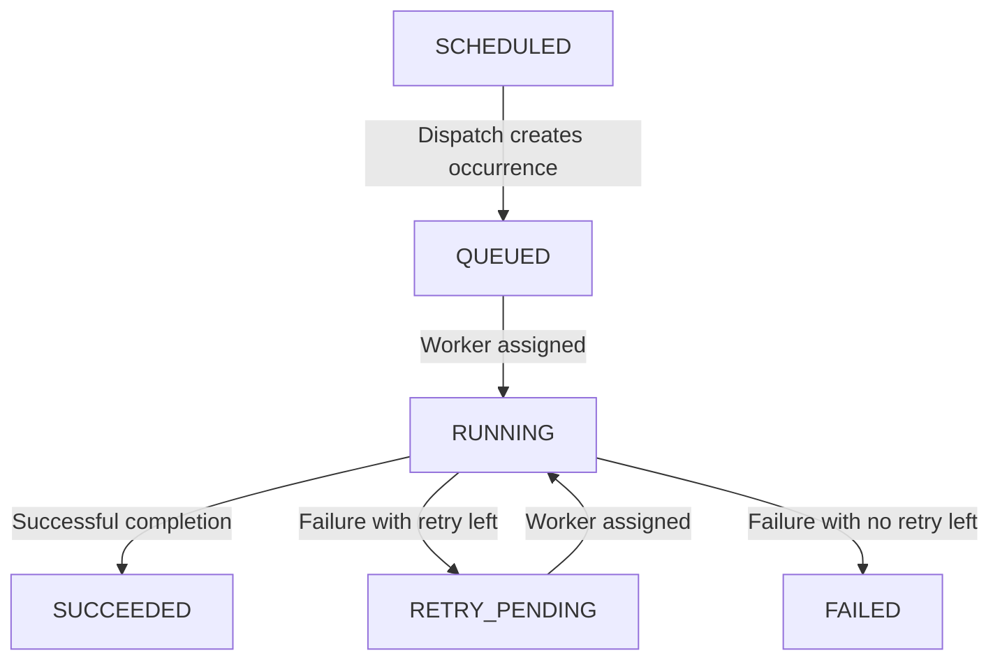

# Design Cron Job Scheduler in Python

#### Problem Statement

[https://codezym.com/question/456-cron-job-scheduler](https://codezym.com/question/456-cron-job-scheduler)


The core idea is to store a job's schedule separately from each occurrence of that job. Dictionaries help us find jobs and occurrences quickly. Small heaps, stored as ordinary Python lists, help us choose the next due occurrence, the next waiting occurrence, and the first available worker in the required order. Each occurrence keeps its own status and attempt number, which makes retries and duplicate prevention straightforward. No formal design pattern or combination of patterns is needed here. Two small dataclasses and an enum are enough for this fixed set of rules.

## 1. Understand jobs, occurrences, and attempts

These three things represent different levels of work.

A **job** stores the schedule. For example, `inventory-sync` might start at second `10` and repeat every `5` seconds.

An **occurrence** is one scheduled run of that job. This job has occurrences at `10`, `15`, `20`, and so on. Each occurrence is identified by its job ID and its original scheduled time.

An **attempt** is one assignment of an occurrence to a worker. If the occurrence scheduled at `10` fails and gets a retry, it is still the occurrence scheduled at `10`. Its attempt number changes from `1` to `2`.

This separation matters because the occurrence at `10` can be retrying while the occurrence at `15` runs on another worker. They must not share one job-level status or attempt counter.

For a one-time job, the interval is `0` and there is only one occurrence.

## 2. Start with a simple approach

We could store jobs and occurrences in dictionaries, then do the following on every `dispatchJobs` call.

1. Scan every job and create its due occurrences, remembering which scheduled times have already been created.
2. Scan every created occurrence and collect those waiting for a first attempt or retry.
3. Sort those pending occurrences by scheduled time and then job ID.
4. Collect and sort the available workers.
5. Pair the first pending occurrence with the first available worker until one list runs out.

This approach can produce the correct result. The problem is the repeated scanning and sorting.

The scheduler can contain up to `100,000` jobs and create up to `200,000` occurrences. A dispatch call might have nothing new to do, yet the simple approach would still inspect many unrelated jobs and completed occurrences.

We can keep the same idea while maintaining the required order as data changes.

## 3. Keep dictionaries for lookup and heaps for ordering

Python does not include a built-in sorted set, but this problem only needs three operations. Insert an item, inspect the smallest item, and remove the smallest item. A heap would be sufficient here.

Python's standard-library `heapq` module provides these operations using an ordinary list. `heappush` inserts an item, `heappop` removes the smallest item, and index `0` gives the smallest item without removing it. The rest of the list is not necessarily in sorted order.

This keeps the same scheduling idea efficient without an external package or a custom tree implementation.

### Find jobs and their occurrences with dictionaries

`self.jobs` maps each job ID to its `Job` object. It also lets us reject duplicate job IDs quickly.

Each `Job` contains an `occurrences` dictionary. Since the surrounding job already identifies the job ID, this inner dictionary only needs the scheduled time as its key.

For example, completing `inventory-sync` at scheduled time `10` needs two lookups. First find the job, then find its occurrence at `10`.

The inner dictionary stores only occurrences that `dispatchJobs` has created. We do not create an unlimited list of future runs for a recurring job.

### Keep one next occurrence time per job

`self.futureJobs` is a heap of tuples containing `(nextRunTimeInSeconds, orderKey, jobId)`. Python compares tuples from left to right, so the earliest time comes first and the job ID's ordering key breaks ties.

The name means an occurrence that still needs to be created. That time can already be overdue if dispatch has not been called recently.

For a job starting at `10` with interval `5`, we initially store only its next time, `10`. After creating that occurrence, we remove the old entry and insert a new entry for `15`. Later, it moves to `20`.

This lets us inspect the earliest uncreated time directly. If that time is greater than the current time, no other job has an occurrence that needs to be created yet.

`orderKey` represents the job ID in the Java string order required by the statement. We keep the original `jobId` in the tuple for dictionary lookup and returned output. The small ordering helper is explained below.

### Put first attempts and retries in the same heap

`self.pendingOccurrences` contains tuples for occurrences in either `QUEUED` or `RETRY_PENDING` state. Each tuple is `(scheduledTimeInSeconds, orderKey, jobId)`.

Its order is the original scheduled time, followed by the job ID's ordering key. After removing a tuple, we use the job ID and scheduled time to find its occurrence in the dictionaries.

A retry does not get a new scheduled time. For example, a retry for time `10` comes before a first attempt for time `15`. At the same time, job `alpha` comes before job `beta`, regardless of which one is retrying.

This heap does not contain running or finished occurrences. Dispatch removes an entry before assigning its occurrence. An accepted failure adds it back only when another retry is allowed.

A heap does not reject duplicates automatically. Our rules prevent duplicates by inserting an occurrence only when it is first created or when its currently running attempt has an accepted failure with a retry left.

### Track registered and available workers separately

`self.registeredWorkers` is a set containing every registered worker, including busy workers. It prevents someone from registering an existing busy worker again.

`self.availableWorkers` is a heap of `(orderKey, workerId)` tuples. It contains only workers that can accept an assignment. Its smallest ID is the next worker to use.

Dispatch removes the chosen worker's tuple from this heap. An accepted completion adds it back.

We do not need a separate `Worker` class because the problem only requires its ID and availability. The running occurrence records which worker is executing it.

## 4. Keep the classes small

The `Job` dataclass owns the schedule, retry limit, next uncreated time, and dictionary of created occurrences. Its `hasScheduledTime` method answers whether a time belongs to the schedule.

`__post_init__` starts the next uncreated time at the first run time and computes the job ID's ordering key once. `field(default_factory=dict)` gives each job its own occurrence dictionary.

The `Occurrence` dataclass owns the status, number of attempts already dispatched, and currently assigned worker. It also refers to its job and stores its original scheduled time.

Dataclasses generate the constructors for these small data-holding classes. We keep the scheduling logic in `CronJobScheduler`.

The `Status` enum represents the five stored states. `SCHEDULED` is returned when a valid occurrence time has no stored occurrence yet, so it does not need an enum value. Each stored enum member has its required output string as its value.

The **State pattern** might sound suitable because statuses change. Here, however, the states have only a few fixed transitions and no separate state-specific services. Creating a class for every state would add several classes around a short piece of logic. An enum and the checks in `completeJob` keep the rules together.

## 5. Follow the occurrence lifecycle



An occurrence can move from `SCHEDULED` through `QUEUED` to `RUNNING` in the same dispatch call when a worker is available.

`SUCCEEDED` and `FAILED` are final states. Those occurrences remain stored for status queries, but they never enter the pending heap again.

## 6. Implement each method

### Register a worker

Reject an ID when it is blank or already registered. Otherwise, add it to the registered-worker set and the available-worker heap.

Use the `_is_blank` helper for validation and store the original string. Do not trim it. For example, `" worker-a "` and `"worker-a"` are different IDs. The helper preserves the Java blank-string behavior used by the original solution.

This method does not change the scheduler's time.

### Schedule a job

First update the scheduler's current time. Then reject a blank ID, an existing job ID, or a first run earlier than that time.

For an accepted job, store a `Job` in the lookup dictionary and push its next-time tuple onto `futureJobs`. Its next time starts at its first run time.

Scheduling does not create an occurrence, even when the first run equals the current time. Creation belongs to `dispatchJobs`.

### Dispatch in two phases

**Phase one creates every due occurrence.** While the earliest uncreated time is at or before the current time, pop its tuple from `futureJobs` and create the occurrence in `QUEUED` state. Store it in the job's occurrence dictionary and push its tuple onto the pending heap.

If the job repeats, advance its next time by its interval and push a new tuple onto `futureJobs`. For a one-time job, do not insert another tuple. The job still remains in the lookup dictionary.

Continue until all due occurrences have been created, even if no workers exist or every worker is busy. Otherwise, a due occurrence could incorrectly remain `SCHEDULED` after a dispatch call.

**Phase two assigns workers.** While both the pending heap and available worker heap are nonempty, pop the smallest item from each. Increase the occurrence's attempt number, mark it `RUNNING`, and remember its worker.

Append the assignment string to the result immediately, so the returned list preserves the assignment order.

The attempt counter starts at `0` because no attempt has been dispatched yet. The first assignment changes it to `1`. A pending retry receives its next attempt number when it is assigned again.

### Accept only the currently running attempt

`completeJob` first updates the current time, then finds the job and its stored occurrence.

Reject the report if the occurrence does not exist, is not `RUNNING`, or has a different attempt number. Perform all these checks before releasing the worker or changing the status.

Once the report is accepted, free the worker and apply the result.

- A successful attempt changes the status to `SUCCEEDED`.
- A failed attempt with another retry available changes the status to `RETRY_PENDING` and returns the occurrence to the pending heap.
- A failed attempt with no retries left changes the status to `FAILED`.

The maximum attempt number is `maxRetries + 1`. Therefore, another attempt is allowed after a failure exactly when the current attempt number is less than that limit.

For example, `maxRetries = 1` permits attempts `1` and `2`. If attempt `2` fails, the occurrence becomes `FAILED`.

An accepted report returns `True`, including when it reports failure. This boolean says that the report was accepted. It does not say that the job succeeded.

Completion never assigns another attempt automatically. A later `dispatchJobs` call does that, and it may use the same current time.

### Read status without creating anything

For a one-time job, only its first run time belongs to its schedule.

For a recurring job, a time belongs to its schedule when it is at least the first run time and the difference is divisible by the interval. Check the zero-interval case before using the remainder operator.

Return an empty string for an unknown job or an invalid occurrence time.

For a valid scheduled time, return the stored occurrence's status if it exists. Otherwise, return `SCHEDULED`.

This remains true even when the requested occurrence is overdue. Advancing time alone does not create occurrences.

## 7. Details that prevent subtle bugs

**Update time before validation.** Every method receiving `currentTimeInSeconds` calls `_advanceTime` first. A rejected scheduling request, rejected completion, or empty status result still updates the clock. Input times are guaranteed to be nondecreasing, so no extra backward-time policy is needed.

**Replace the old next-time tuple.** Pop a job's existing entry from `futureJobs` before pushing its next occurrence time. Each active schedule has only one entry in that heap. The tuple stores the time itself, so changing the `Job` object does not change a tuple already in the heap.

**Advance from the scheduled time.** A recurring job scheduled for `10`, `15`, and `20` must keep those times even if dispatch first happens at `23`. Using the dispatch time as the starting point would skip occurrences and shift the schedule.

**Keep occurrence ordering keys unchanged.** Pending tuples are ordered by the original scheduled time and job ID's ordering key. Their occurrence's status, worker, and attempt counter do not affect ordering.

**Do not treat a repeated timestamp as a duplicate call.** A completion or a new job may have changed what can be dispatched at that time. Prevent duplicate work by tracking individual occurrences and running attempts, rather than skipping every repeated dispatch timestamp.

**Use Python integers for time.** Python's `int` handles times such as `1,000,000,000,000` directly. There is no separate `long` type to select, and no fixed-width overflow when adding an interval.

**Preserve the required Java string order.** The statement specifies `String.compareTo`, which compares UTF-16 code units. Python's default string order agrees for ordinary English IDs, but it can differ for some Unicode IDs, such as those containing emoji. `_java_string_key` encodes an ID as UTF-16 big-endian bytes. Comparing these byte strings gives the required order, while the original ID remains unchanged. Do not lowercase IDs or apply human-style numeric sorting to names such as `worker-2` and `worker-10`.

**Match blank-string validation.** Python's `str.isspace()` includes four characters excluded by Java's `String.isBlank()`. `_is_blank` filters out those four characters and checks the remaining characters without changing the ID. An empty string is also blank because `all` over an empty sequence returns `True`.

## 8. Walk through a retry and an overlapping occurrence

Register `worker-b` and `worker-a`. Schedule `alpha` once at time `10` with no retries. Schedule `beta` starting at `10`, repeating every `5` seconds, with one retry allowed. Both scheduling requests happen at time `0`.

1. **Call `dispatchJobs(15)`.** It creates `alpha` at `10`, `beta` at `10`, and `beta` at `15`. The result is `["alpha,10,1,worker-a", "beta,10,1,worker-b"]`. The later `beta` occurrence stays `QUEUED` because both workers are busy.

2. **Report failure for `beta`, scheduled at `10`, attempt `1`, at current time `15`.** The report returns `True`. That occurrence becomes `RETRY_PENDING`, and `worker-b` becomes available.

3. **Call `dispatchJobs(15)` again.** The result is `["beta,10,2,worker-b"]`. The retry keeps its original scheduled time, so it comes before the occurrence at `15`.

4. **Report a delayed success for `beta`, scheduled at `10`, attempt `1`, at current time `15`.** The report returns `False` because attempt `2` is running. Its status and worker remain unchanged.

5. **Complete `alpha`, scheduled at `10`, attempt `1`, successfully at current time `16`.** The report returns `True` and releases `worker-a`. The occurrence of `beta` at `15` still waits for dispatch.

6. **Call `dispatchJobs(16)`.** The result is `["beta,15,1,worker-a"]`. Now two occurrences of `beta` are running on different workers. Each has its own attempt number.

7. **Report failure for `beta`, scheduled at `10`, attempt `2`, at current time `16`.** The report returns `True`, and that occurrence becomes `FAILED`. Its allowed retry has been used. The occurrence scheduled at `15` is still `RUNNING`.

8. **Request the status of `beta` at scheduled time `20`, with current time `25`.** The result is `SCHEDULED`. No dispatch call has created that occurrence yet, even though its scheduled time has passed.

## 9. Why the solution is correct

### Each occurrence is created once

A job's entry in `futureJobs` always identifies its next uncreated occurrence. Creating it removes that entry and either inserts a time advanced by a positive interval or leaves a one-time job without another entry. An already-created time is never generated again.

The creation loop stops only when the smallest remaining time is greater than the current time. Since all other times are at least that large, every due occurrence has been created.

### Each assignment follows the required order

The pending heap contains one tuple for every created occurrence waiting for an assignment, including retries. Its smallest entry is exactly the occurrence required by the scheduled-time and job-ID rules.

The available worker heap contains one tuple for each free worker. Its smallest entry is exactly the worker required by the worker-ID rule.

Popping and pairing those entries repeatedly produces the required assignment order.

### Running work cannot be dispatched twice

Dispatch removes both the occurrence's tuple and its worker's tuple from their heaps. The occurrence cannot be selected again while running, and the worker cannot receive a second assignment.

An accepted failed attempt can put its occurrence back into the pending heap only after releasing its worker. Its next dispatch increases the attempt number. Successful or exhausted occurrences are never put back.

### Old reports cannot change later attempts

Completion requires both `RUNNING` status and an exact attempt-number match. A duplicate report fails after the original attempt has finished. A report for an earlier attempt also fails while a later attempt is running.

Because validation happens before any worker or occurrence update, rejected reports leave execution state unchanged. In particular, they cannot insert a duplicate worker or retry into a heap.

## 10. Time and space complexity

Let `J` be the number of stored jobs, `C` the number of created occurrences, and `W` the number of registered workers. For one dispatch call, let `D` be the number of newly created occurrences and `K` the number of assigned attempts.

Dictionary and set lookups take expected constant time. Heap insertion and removal take logarithmic time, amortized when accounting for the underlying list resizing. Inspecting the smallest heap entry takes constant time. ID lengths are bounded by the problem.

- **Constructor:** `O(1)`.
- **`registerWorker`:** `O(log(W + 1))` for a successful registration.
- **`scheduleJob`:** `O(log(J + 1))` for a successful scheduling request.
- **`getJobStatus`:** expected `O(1)`.
- **`completeJob`:** `O(log(W + 1) + log(C + 1))` in the retry case. A rejected report takes expected `O(1)`.
- **`dispatchJobs`:** `O(1 + D log(J + 1) + (D + K) log(C + 1) + K log(W + 1))`.

The dispatch expression counts advancing due jobs, adding and removing pending tuples, and removing assigned workers. Checking the earliest uncreated time takes constant time, including when nothing is due. The `+ 1` inside each logarithm handles empty collections in the bound.

Total stored space is `O(J + C + W)`. This includes the dictionaries, heaps, worker set, and cached ordering keys. The returned assignment list additionally takes `O(K)` space. Finished occurrences remain stored because callers may request their status later.


## 12. Complete Python solution


```python
from dataclasses import dataclass, field
from enum import Enum
from heapq import heappop, heappush
from typing import Dict, List, Optional, Set, Tuple


def _java_string_key(value: str) -> bytes:
    # Match the UTF-16 ordering required by Java String.compareTo.
    return value.encode("utf-16-be", errors="surrogatepass")


def _is_blank(value: str) -> bool:
    # Python considers these four extra characters whitespace. Java does not.
    return all(
        character.isspace() and character not in "\u0085\u00a0\u2007\u202f"
        for character in value
    )


class Status(Enum):
    QUEUED = "QUEUED"
    RETRY_PENDING = "RETRY_PENDING"
    RUNNING = "RUNNING"
    SUCCEEDED = "SUCCEEDED"
    FAILED = "FAILED"


# A job stores its schedule and all occurrences created for that schedule.
@dataclass
class Job:
    jobId: str
    firstRunTimeInSeconds: int
    intervalInSeconds: int
    maxRetries: int
    occurrences: Dict[int, "Occurrence"] = field(
        default_factory=dict, init=False, repr=False
    )
    nextRunTimeInSeconds: int = field(init=False)
    orderKey: bytes = field(init=False, repr=False)

    def __post_init__(self) -> None:
        self.nextRunTimeInSeconds = self.firstRunTimeInSeconds
        self.orderKey = _java_string_key(self.jobId)

    def hasScheduledTime(self, scheduledTimeInSeconds: int) -> bool:
        if scheduledTimeInSeconds < self.firstRunTimeInSeconds:
            return False

        if self.intervalInSeconds == 0:
            return scheduledTimeInSeconds == self.firstRunTimeInSeconds

        return (
            (scheduledTimeInSeconds - self.firstRunTimeInSeconds)
            % self.intervalInSeconds
            == 0
        )


# One occurrence has its own status, attempt count, and assigned worker.
@dataclass
class Occurrence:
    job: Job
    scheduledTimeInSeconds: int
    status: Status = Status.QUEUED
    attemptNumber: int = 0
    workerId: Optional[str] = None


class CronJobScheduler:
    def __init__(self) -> None:
        self.jobs: Dict[str, Job] = {}
        self.registeredWorkers: Set[str] = set()
        self.availableWorkers: List[Tuple[bytes, str]] = []

        # Each entry represents the next occurrence not yet created for a job.
        self.futureJobs: List[Tuple[int, bytes, str]] = []

        # First attempts and retries share the same ordering.
        self.pendingOccurrences: List[Tuple[int, bytes, str]] = []

        self.currentTimeInSeconds = 0

    def registerWorker(self, workerId: str) -> bool:
        # Validate without trimming, so accepted IDs stay exactly as supplied.
        if _is_blank(workerId) or workerId in self.registeredWorkers:
            return False

        self.registeredWorkers.add(workerId)
        heappush(self.availableWorkers, (_java_string_key(workerId), workerId))
        return True

    def scheduleJob(
        self,
        jobId: str,
        firstRunTimeInSeconds: int,
        intervalInSeconds: int,
        maxRetries: int,
        currentTimeInSeconds: int,
    ) -> bool:
        self._advanceTime(currentTimeInSeconds)

        if (
            _is_blank(jobId)
            or jobId in self.jobs
            or firstRunTimeInSeconds < self.currentTimeInSeconds
        ):
            return False

        job = Job(jobId, firstRunTimeInSeconds, intervalInSeconds, maxRetries)
        self.jobs[jobId] = job
        heappush(
            self.futureJobs,
            (job.nextRunTimeInSeconds, job.orderKey, job.jobId),
        )
        return True

    def dispatchJobs(self, currentTimeInSeconds: int) -> List[str]:
        self._advanceTime(currentTimeInSeconds)

        # Create every due occurrence, even if all workers are busy.
        self._createDueOccurrences()

        assignments = []
        while self.pendingOccurrences and self.availableWorkers:
            scheduledTimeInSeconds, _, jobId = heappop(self.pendingOccurrences)
            occurrence = self.jobs[jobId].occurrences[scheduledTimeInSeconds]
            _, workerId = heappop(self.availableWorkers)

            occurrence.attemptNumber += 1
            occurrence.status = Status.RUNNING
            occurrence.workerId = workerId

            assignments.append(
                f"{occurrence.job.jobId},{occurrence.scheduledTimeInSeconds},"
                f"{occurrence.attemptNumber},{workerId}"
            )

        return assignments

    def completeJob(
        self,
        jobId: str,
        scheduledTimeInSeconds: int,
        attemptNumber: int,
        successful: bool,
        currentTimeInSeconds: int,
    ) -> bool:
        self._advanceTime(currentTimeInSeconds)

        job = self.jobs.get(jobId)
        if job is None:
            return False

        occurrence = job.occurrences.get(scheduledTimeInSeconds)
        if (
            occurrence is None
            or occurrence.status != Status.RUNNING
            or occurrence.attemptNumber != attemptNumber
        ):
            return False

        # Release the worker only after validating the running attempt.
        workerId = occurrence.workerId
        assert workerId is not None
        heappush(self.availableWorkers, (_java_string_key(workerId), workerId))
        occurrence.workerId = None

        if successful:
            occurrence.status = Status.SUCCEEDED
        elif occurrence.attemptNumber < job.maxRetries + 1:
            occurrence.status = Status.RETRY_PENDING
            heappush(
                self.pendingOccurrences,
                (occurrence.scheduledTimeInSeconds, job.orderKey, job.jobId),
            )
        else:
            occurrence.status = Status.FAILED

        # The report was accepted, even when the attempt itself failed.
        return True

    def getJobStatus(
        self,
        jobId: str,
        scheduledTimeInSeconds: int,
        currentTimeInSeconds: int,
    ) -> str:
        self._advanceTime(currentTimeInSeconds)

        job = self.jobs.get(jobId)
        if job is None or not job.hasScheduledTime(scheduledTimeInSeconds):
            return ""

        occurrence = job.occurrences.get(scheduledTimeInSeconds)
        return "SCHEDULED" if occurrence is None else occurrence.status.value

    def _advanceTime(self, currentTimeInSeconds: int) -> None:
        # Inputs already guarantee that time never moves backward.
        self.currentTimeInSeconds = currentTimeInSeconds

    def _createDueOccurrences(self) -> None:
        while (
            self.futureJobs
            and self.futureJobs[0][0] <= self.currentTimeInSeconds
        ):
            # Remove the old entry before advancing this job's next time.
            scheduledTimeInSeconds, _, jobId = heappop(self.futureJobs)
            job = self.jobs[jobId]

            occurrence = Occurrence(job, scheduledTimeInSeconds)
            job.occurrences[scheduledTimeInSeconds] = occurrence
            heappush(
                self.pendingOccurrences,
                (scheduledTimeInSeconds, job.orderKey, job.jobId),
            )

            if job.intervalInSeconds > 0:
                # Continue from the scheduled time, not the dispatch time.
                job.nextRunTimeInSeconds = (
                    scheduledTimeInSeconds + job.intervalInSeconds
                )
                heappush(
                    self.futureJobs,
                    (job.nextRunTimeInSeconds, job.orderKey, job.jobId),
                )
```
